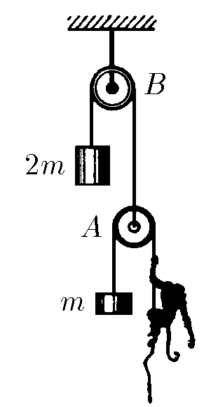
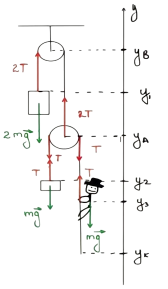

###  Statement

$2.2.24$ A monkey of mass $m$ is balanced by a counterweight on block $A$. Block $A$ is balanced by a weight of $2m$ on block $B$. The system is stationary. How will the load move if the monkey starts to evenly select the rope at a speed $u$ relative to itself? Ignore the mass of blocks and friction

### Solution

Newton's second law of motion for y-axis:

$$
\begin{cases} 2T - 2mg = 2ma_{1y} \\\ T - mg = ma_{2y} \\\ T - mg = ma_{3y} \end{cases}
$$

From these three equations, it's evident that:

$$
a_1 = a_{2y} = a_{3y}
$$

$$
\quad \int_0^{v_{1y}} dv_{1y} = \int_0^{v_{2y}} dv_{2y} = \int_0^{v_{3y}} dv_{3y}
$$

$$
v_{1y} = v_{2y} = v_{3y}
$$

The lengths of two ropes:

$$
\begin{cases} L_1 = 2y_b - y_1 - y_a \\\ L_2 = 2y_A - y_2 - y_k \end{cases}
$$

Taking the derivative of the rope lengths with respect to time, we obtain these relationships:

$$
\begin{cases} 0 = 2v_{by} - v_{1y} - v_{Ay} \\\ 0 = 2v_{Ay} - v_{2y} - v_{ky} \end{cases}
$$

From velocity-addition formula:

$$
\vec{v} = \vec{v}^\prime + \vec{u}
$$

$ v_{ky} = v_{3y} + u_y$ from the conditions of the problem

Eventually:

$$
v_{1y} = -v_Ay \quad (v_{by} = 0)
$$

$$
2v_{1y} + v_{2y} + v_{ky} = 0
$$

$$
2v_{1y} + v_{2y} + v_{3y} + u_y = 0
$$

$$
4v_{1y} = -u_y
$$

$$
v_{1y} = -\frac{u_y}{4}
$$