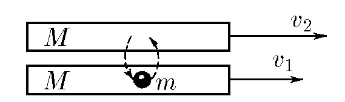

###  Statement

$2.2.34.$ Two trolleys of mass $M$ each move in parallel with the initial speeds $v_1$ and $v_2$ ($\vec{v}_2 > \vec{v}_1$). A load of mass $m$, which initially lay on the first trolley, is transferred to the second trolley with almost zero speed relative to this trolley. Then, with almost zero speed relative to the second trolley, it is transferred back to the first one. What will be the speed difference of the trolleys after $N$ such transfers of cargo back and forth? Try to explain qualitatively the viscous friction that occurs when gas layers slip relative to each other.

### Solution

From first to second:

$$
m v_1 + M v_2 = (M + m) u_2
$$

$$
u_2 = \frac{m v_1 + M v_2}{M + m}
$$

$$
P_x = \text{const!}
$$

Second to first:

$$
M v_1 + m u_2 = (M + m) u_1
$$

$$
u_1 = \frac{M v_1 + m u_2}{M + m}
$$

About the change:

$$
\Delta u = u_1 - u_2
$$

$$
u_1 > u_2
$$

$$
\Delta u = \left(\frac{M}{M + m}\right)^2 (v_1 - v_2)
$$

$$
\kappa = \left(\frac{M}{M + m}\right)^2
$$

$$
\Delta v = v_1 - v_2
$$

$$
\Delta u_N = \kappa^N \Delta v
$$

$$
\Delta u_N = \left(\frac{M}{M + m}\right)^{2N} (v_1 - v_2)
$$

$$
\boxed{|\Delta u_N| = \left(\frac{M}{M + m}\right)^{2N} (v_2 - v_1)}
$$

#### Answer

$$
\left(\frac{M}{M+m}\right)^{2N}(v_2-v_1).
$$