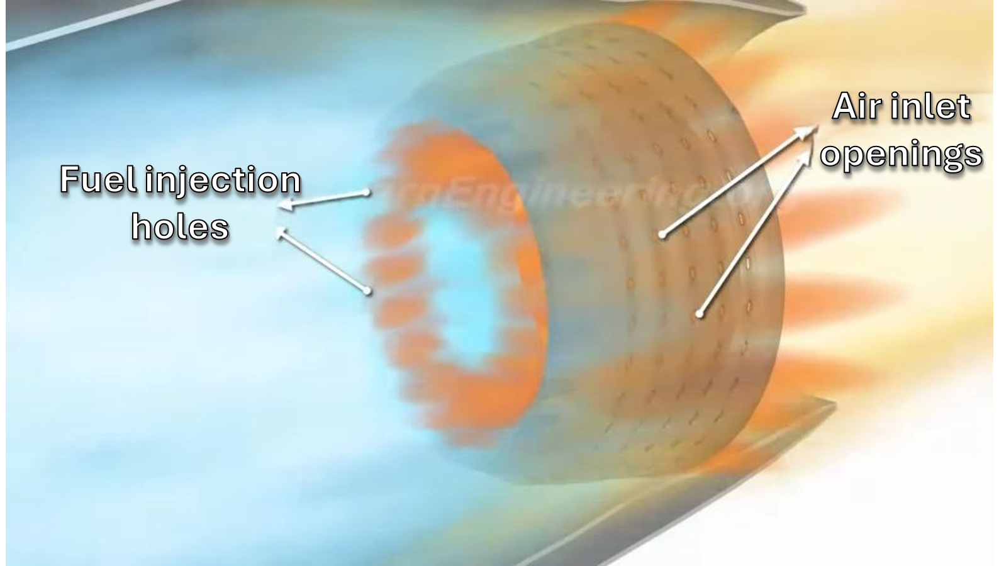
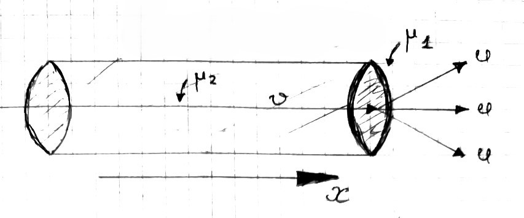

###  Statement

$2.2.37.$ Determine the thrust force of an air-jet engine of an airplane flying at a speed of $V$. The mass consumption of fuel and air entering the engine is equal to $\mu_1$ and $\mu_2$, respectively. Velocity of combustion products relative to the aircraft at the engine exit $u$.

### Solution

\begin{equation*} \Delta p_x = ((\mu_1 + \mu_2)u - \mu_2 v) \Delta t \end{equation*}

From the condition:

$$
u_{\text{rel}} = u, \quad v_{\text{rel}} = v
$$

Write the vector sum for the relative velocities

$$
\vec{v}_{\text{rel}} = \vec{0} - \vec{v}
$$

$$
v_{\text{rel} \, x} = -v_x
$$

$$
+v_{\text{rel}} = -(-v) = v
$$

Find the change in momentum over a soapy time interval \begin{equation*} \Delta p_x = \left( \mu_1 u + \mu_2 (u - v) \right) \Delta t \end{equation*} Let's use Newton's second law in impulse form \begin{equation*} F_x = \frac{\Delta p_x}{\Delta t} = \mu_1 u + \mu_2 (u - v) \end{equation*} By definition of mass consumption

$$
m_1 = \mu_1 \Delta t, \quad m_2 = \mu_2 \Delta t
$$

According to Newton's third law, these forces are equal to \begin{equation*} T = -F_x \end{equation*} From where the required thrust force

$$
\boxed{|T| = \mu_1 u + \mu_2 (u - v)}
$$

#### Answer

$$
F = \mu_2 (u - v) + \mu_1 u
$$