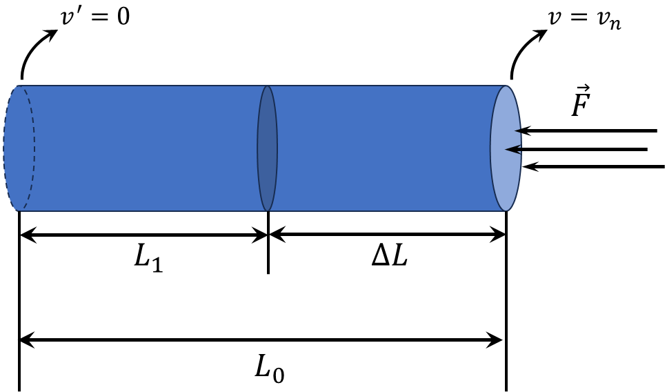

###  Statement

$2.2.39.$ The tube of radius $r$ is filled with a porous substance of density $\rho_0$. The piston, which acts on a constant force $F$, moving in the pipe, compacts the substance to a density $\rho$. At what speed does the piston move if the compaction of the substance occurs in a jump, i.e. the interface moves at a certain speed in the pipe, to the right of which the density of the substance is $\rho$, and to the left-$\rho_0$? At the initial moment, this boundary coincides with the surface of the piston.

### Solution

From the drawing

$$
\Delta L=L_0-L
$$

During the time $\Delta t$ the piston with velocity $v$ has moved by the amount $\Delta l$

$$
\Delta L=v\Delta t
$$

Given a constant cross-sectional area $S=\pi r^2$, the expression from above can be rewritten as

$$
\frac{m}{\rho_0S}-\frac{m}{\rho S}=v\Delta t
$$

$$
\frac{m}{\Delta t}=Sv\frac{\rho\rho_0}{\rho -\rho_0}
$$

Because the mass remains constant ($m=\text{const}$):

$$
m=\rho_0SL_0=\rho SL
$$

From where

$$
\frac{\rho}{\rho_0}=\frac{L_0}{L}
$$

Representing the force by a small change in momentum

$$
F_\text{average}=\frac{mv_\text{system}}{\Delta t}
$$

Substituting the value of $\frac{m}{\Delta t}$:

$$
F_\text{average}=Sv\frac{\rho\rho_0}{\rho -\rho_0}v_\text{system}
$$

$$
v_\text{system}=\frac{0+v}{2}=\frac{v}{2}
$$

$$
F_\text{average}=\frac{0+F}{2}=\frac{F}{2}
$$

Substitute into the formula for $F_\text{average}$:

$$
\frac{F}{2}=Sv\frac{\rho\rho_0}{\rho -\rho_0}\frac{v}{2}
$$

From where

$$
\boxed{v=\sqrt{\frac{F(\rho -\rho_0)}{\pi r^2\rho\rho_0}}}
$$

#### Answer

$$
v=\sqrt{F(\rho -\rho_0)/(\pi r^2\rho\rho_0)}
$$