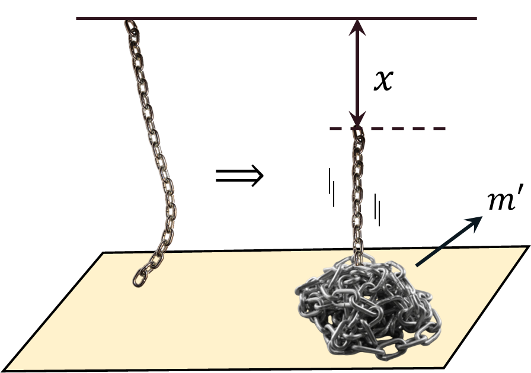

###  Statement

$2.2.41.$ A uniform chain is suspended from the thread at one end so that the other end touches the surface of the table. The thread is burned out. Determine the dependence of the pressure force of the chain on the table on the length of its part that has not yet fallen. The impact of the links on the table is inelastic, the mass of the chain is $m$, its length is $l$.

### Solution

As the chain is homogeneous, the linear density

$$
\rho =\frac{m}{L}
$$

Than, the mass of the fallen part of the chain

$$
m_x'=\rho\cdot x=m\frac{x}{L}
$$

The first few parts of the chain with mass $m_x'$ came at near-zero velocity

Newton's second law for the force $F_1$, which is due to the change in momentum as it interacts with the ground.

$$
F_1=\frac{\Delta p}{\Delta t}=\frac{m_x'\cdot\Delta v}{\Delta t}
$$

As the lower part of the thread has almost no time to acquire velocity, the $\Delta v$ tends to zero:

$$
\Delta v \to 0;\quad F_1\to0
$$

The gravitational force of the fallen part of the chain:

$$
F_g=m_x'g=\frac{mx}{L}g
$$

Consider an infinitesimal fraction of $\Delta x$ that has velocity $v$ and will fall while $m_x'$ is at rest

$$
m'_{\Delta x}=\rho\cdot \Delta x=m\cdot\frac{\Delta x}{L}
$$

Change in the momentum $\Delta p'_{\Delta x}$ over the small period of time $\Delta t$

$$
\frac{\Delta p'_{\Delta x}}{\Delta t} =\frac{m'_{\Delta x}\cdot v}{\Delta t}=\frac{mv}{L}\frac{\Delta x}{\Delta t} = \boxed{\frac{mv^2}{L}}\tag{1}
$$

The falling time could be found as

$$
x=\frac{gt^2}{2}\Rightarrow t=\sqrt{\frac{2x}{g}}
$$

Similarly, the velocity at the lowest point

$$
v=gt=\sqrt{2gx}\Rightarrow v^2=2gx
$$

Substituting into $(1)$:

$$
F_2=\frac{\Delta p'_{\Delta x}}{\Delta t}=\frac{2mgx}{L}
$$

Support reaction force

$$
N=F_1+F_2+F_g=0+\frac{mgx}{L}+\frac{2mgx}{L}
$$

$$
N=\frac{3mgx}{L}\tag{2}
$$

The length length of its part that has not yet fallen

$$
L_0=L-x\Leftrightarrow x=L-L_0
$$

After substituting into $(2)$

$$
\boxed{N=3mg\left(1-\frac{L_0}{L}\right)}
$$

#### Answer

$$
F=3mg(1-x/l)
$$