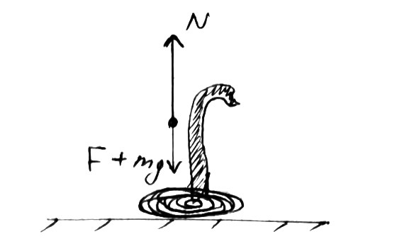

###  Statement

$2.2.42.$ With what force does the cobra press on the ground when it is preparing to jump, rises vertically upwards at a constant speed $v$? The mass of the snake is $m$, its length is $l$.

### Solution

Let's consider small part of cobra with the length $\Delta x$ and mass $\Delta m$: \begin{equation*} \Delta P = \Delta m \cdot v \end{equation*} Since the snake is homogeneous \begin{equation*} \Delta m = \frac{m}{L} \cdot \Delta x \end{equation*} By newton's second law: \begin{equation*} F=\frac{\Delta P}{\Delta t} = \frac{\Delta m}{\Delta t} \cdot v \end{equation*}

$$
F = \frac{m}{L} \cdot \frac{\Delta x}{\Delta t} \cdot v = \frac{mv^2}{L}
$$

By definition of speed \begin{equation*} \frac{\Delta x}{\Delta t} = v \end{equation*} Whence the force associated with the acceleration of the centre of mass \begin{equation*} F = \frac{\Delta P}{\Delta t} = \frac{mv^2}{L} \end{equation*} Let's take everything together and find the support reaction force \begin{equation*} N = mg + \frac{mv^2}{L} = m\left(g + \frac{v^2}{L}\right) \end{equation*} \begin{equation*} \boxed{N = m\left(g + \frac{v^2}{L}\right)} \end{equation*}

#### Answer

$$
N = m\left(g + \frac{v^2}{L}\right)
$$