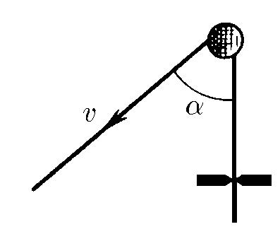
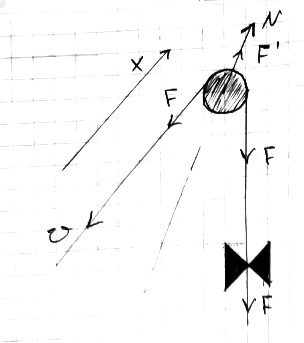
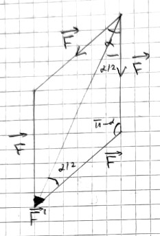
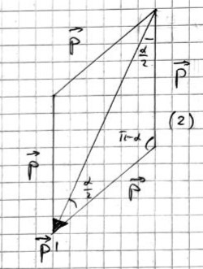

###  Statement

$2.2.44^*.$ A rope thrown over a smooth nail is dragged at a speed of $v$ through the gap. The friction force in the slot $F$, the mass of the rope length unit $\rho$. Determine the force exerted on the nail if the rope sections on opposite sides of the nail form an angle $\alpha$. At what speed will the rope move away from the nail?

### Solution

  Forces acting on the system

$$
\rho = \frac{m}{l} = \frac{\Delta m}{\Delta l}
$$

$$
\cos\left(\frac{\alpha}{2}\right) = \sqrt{\frac{1+\cos\alpha}{2}}
$$

  For problem $2.2.44^*$

For the thread to be stretched at a constant speed $\vec{v}$, there must be a force on the first half that is modulo the frictional force $\vec{F}$:

$$
F'^2=F^2+F^2-2F^2\cos(\pi -\alpha )
$$

$$
F'=F\sqrt{2(1+\cos\alpha )}
$$

$$
F'=2F\cos\frac{\alpha}{2}
$$

  For problem $2.2.44^*$

Similiarly,

$$
p'^2=p^2+p^2-2p^2\cos(\pi -\alpha )
$$

$$
p'=p\sqrt{2(1+\cos\alpha )}
$$

$$
p'=2p\cos\frac{\alpha}{2}
$$

By definition of momentum

$$
p=\Delta m v
$$

From where, considering that $p'$ and $F'$ acts against $Ox$

$$
p'=-2\Delta m v\cos\frac{\alpha}{2}
$$

$$
F'=2F\cos\frac{\alpha}{2}
$$

Let's write Newton's second law

$$
\sum \vec{F}=0
$$

$$
N-F'-F''=0
$$

$$
N-2F\cos\frac{\alpha}{2}+2\Delta m v\cos\frac{\alpha}{2}=0
$$

$$
F''=\frac{p'}{\Delta t}
$$

From where we obtain the force $\vec{N}$

$$
N=2\cos\frac{\alpha}{2}(\frac{-\Delta m v}{\Delta t}+F)
$$

By definition of density

$$
\Delta m = \rho\Delta x
$$

By definition of speed

$$
v = \frac{\Delta x}{\Delta t}
$$

$$
N = 2F\cos\frac{\alpha}{2} - 2\rho v^2\cos\frac{\alpha}{2}
$$

$$
\boxed{N = 2\cos\frac{\alpha}{2} (F -\rho v^2)}
$$

When the rope comes off

$$
N\leq0
$$

$$
F-\rho v^2\leq0
$$

$$
{F\leq \rho v^2}
$$

From where we finally get

$$
\boxed{v \geq \sqrt{\frac{F}{\rho}}}
$$

#### Answer

$$
N=2(F-\rho v^2)\cos\frac\alpha 2;\text{ при }v\geqslant\sqrt{F/\rho}.
$$