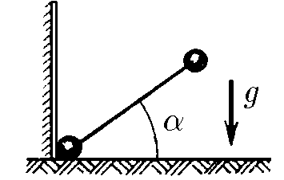
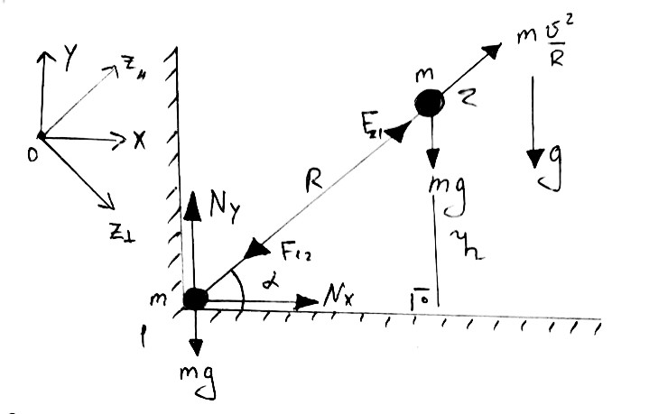

###  Statement 

$2.3.30.$ Determine the force exerted on the vertical wall by the falling dumbbell when the dumbbell axis is at an angle $\alpha$ with the horizon. The dumbbell starts moving from a vertical position without initial velocity. Mass of each dumbbell ball $m$. 

### Solution

  Forces acting on the system 

Along the axis $OZ_\parallel$ "The Two-Ball System": 

Centripetal acceleration associated with circular rotation: $$a=\frac{v^2}{R}$$ From the Newton's second law: $$\frac{mv^2}{R}=2mg\sin\alpha -N_x\cos\alpha -N_y\sin\alpha$$ Law of Conservation of Energy $$mgR=mgh+\frac{mv^2}{2}$$ $$h=R\sin\alpha$$ $$\frac{mv^2}{R}=2mg(1-\sin\alpha )$$ $$N_y\sin\alpha +N_x\cos\alpha =(4\sin\alpha -2)mg$$ Along the axis $OZ_\perp$ "The Ball System": $$N_y\cos\alpha =N_x\sin\alpha +mg\cos\alpha$$ $$N_y=mg+N_x\tan\alpha$$ $N_y$ found from the axis $OZ_\perp$ we substitute into $N_y$ found from the axis $OZ_\parallel$ $$mg\sin\alpha\cos\alpha +N_x\sin^2 \alpha +N_x\cos^2 \alpha =2mg(2\sin\alpha -2)\cos\alpha$$ $$\frac{N_x}{mg}=4\sin\alpha\cos\alpha -2\cos\alpha -\sin\alpha\cos\alpha$$ $$\boxed{N_x=(3\sin\alpha -2)\cos\alpha\cdot mg}$$ When $N_x \leq0$, the shoe will break away from the vertical wall and will no longer act on it: $$N_x=0$$ Condition of detachment: $$(3\sin\alpha -2)\cos\alpha\leq0$$ $$3\sin\alpha -2\leq0 \Leftrightarrow \boxed{\sin\alpha\leqslant2/3}$$ 

#### Answer

$$F=mg\cos\alpha (3\sin\alpha -2)\mathrm{~with~}\sin\alpha\geqslant2/3;$$ $$F=0\mathrm{~with~}\sin\alpha\leqslant2/3.$$ 
