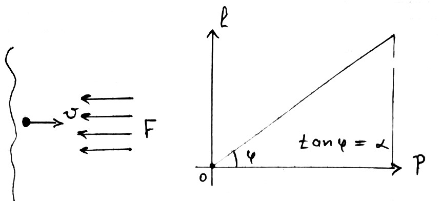

###  Statement

$2.3.35.$ A particle of mass $m$ flies into a region where it is affected by a braking force that depends only on the distance between the particle and the boundary of the region. Find this dependence if the depth of penetration of a particle into the braking region is proportional to its initial momentum: $l = \alpha p$.

### Solution

The work done by the force $F$ when the particle moves $dl$

$$
F dl = dA \quad (1)
$$

From the law of conservation of energy

$$
\quad \frac{m u^2}{2} = \frac{p^2}{2m}
$$

Considering a small increment of energy

$$
dE = \frac{d(p^2)}{2m} = \frac{p dp}{m} \quad (2) \quad dA = dE \Rightarrow F dl = \frac{p dp}{m} \\
$$

$$
\quad F = \frac{p}{m} \frac{dp}{dl} = \frac{p}{m} \frac{1}{\alpha} = \frac{1}{m} \frac{l}{\alpha} \frac{1}{\alpha} = \frac{l}{m \alpha^2} \quad (*)
$$

From where

$$
\quad \frac{dp}{dl} = \frac{1}{\alpha} , \quad p = \frac{l}{\alpha} \\\ \quad \boxed{F = \frac{l}{m \alpha^2}}
$$

#### Answer

$$
F={l}/{(m \alpha^2)}
$$