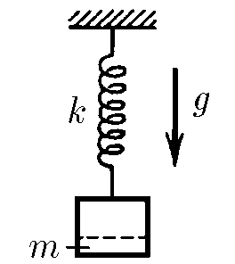

###  Statement

$2.3.41.$ A part of the mass $m$ is detached from the load hanging on the spring of stiffness $k$. To what height will the remaining part of the cargo then rise?

### Solution

Since there is no interaction with external factors other than breakaway, all the work goes into changing the length of the spring. $E_k=0$!

Small change in the pontential energy of gravity

$$
dA = mg \, dx
$$

Small change in the pontential energy of the spring

$$
dE = kx \, dx
$$

Law of conservation of energy

$$
dA = dE
$$

$$
mg \, dx = kx \, dx
$$

$$
mg \int dx = k \int x \, dx
$$

From where

$$
mg \, x = \frac{kx^2}{2} \Rightarrow \boxed{x = \frac{2mg}{k}}
$$

#### Answer

$$
x = \frac{2mg}{k}
$$