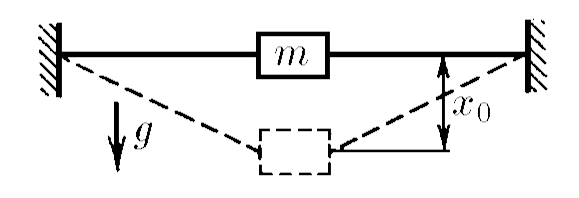
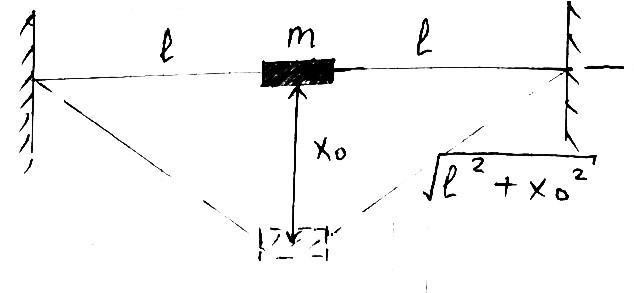

###  Statement 

$2.3.44.$ An unstretched rubber cord of length $2l$ is attached to the walls by its ends. A weight of mass $m$ was attached to the middle of the cord, which was then released without a push. When vibrations occur, the greatest distance to which the load is lowered is $x_0$. What is the stiffness of this cord? 

### Solution

  Geometry of the problem 

Potential energy of the weight: $$E_p = -mgx_0 $$ Potential energy of rubber cord $$E_p' = k' \frac{(\sqrt{l^2 + x_0^2} - l)^2}{2}$$ From the law of conservation of energy, the total energy of the system must equal zero $$E = 0 = E_p + E_p' + E_p'$$ It follows from the figure that the stretching of the cord is $$\Delta L = \sqrt{l^2 + x_0^2} - l$$ Since we now consider them as separate springs, cords, we use superposition: $$\frac{1}{k} = \frac{1}{k'} + \frac{1}{k'} \implies k' = 2k $$ From where stiffness of the cord could be found as $$mgx_0 = \frac{2 \cdot 2k \cdot \left(\sqrt{l^2 + x_0^2} - l \right)^2}{2}$$ $$\boxed{k = \frac{mgx_0}{2 \cdot \left( \sqrt{l^2 + x_0^2} - l \right)^2}}$$ 

#### Answer

$$k = \frac{mgx_0}{2 \cdot \left( \sqrt{l^2 + x_0^2} - l \right)^2}$$ 
