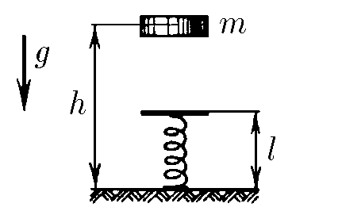

###  Statement

$2.3.45.$ A body of mass $m$ falls from a height $h$ onto a spring of stiffness $k$ and length $l$ standing vertically on the floor. Determine the maximum pressure on the floor. Explain why this force increases as the spring stiffness increases.

### Solution

Conservation of kinetic and potential energies

$$
mgh = \frac{mv^2}{2} + mgH + \frac{k(l-H)^2}{2}
$$

Since at a finite instant of time, the body stops $(v=0)$

$$
mgh=mg(l-\Delta x)+\frac{k\Delta x^2}{2}\quad (1)
$$

From the drawing

$$
H=l-\Delta x
$$

Let's substitute into $(1)$

$$
\frac{k\Delta x^2}{2}-mg\Delta x-mg(h-l)=0
$$

Solve as a quadratic equation

$$
\Delta x = \frac{mg}{k}\left(1\pm\sqrt{1+\frac{2k\cdot(h-l)}{mg}}\right)
$$

As $\Delta x$ must be positive, we keep only the plus solution

$$
\Delta x = \frac{mg}{k}\left(1+\sqrt{1+\frac{2k\cdot(h-l)}{mg}}\right)
$$

Since at the bottom point, there are no forces other than the support reaction force $N$ and spring elasticity force $k\Delta x$, and at the bottom position the acceleration is zero ($a=0$) and the forces are compensated, the condition of equilibrium on the vertical axis has the form

$$
F_y=N
$$

Whence we obtain the maximum force of pressure on the floor, which is equal to the force with which the support acts on the load, according to Newton's third law

$$
F_y=k\cdot \Delta x\Rightarrow \boxed{N=mg\left(1+\sqrt{1+\frac{2k\cdot(h-l)}{mg}}\right)}
$$

Analysing the obtained expression, we obtain that $F\sim \sqrt{k}\to$ Therefore, the greater the spring stiffness $k$, the greater the support reaction force $N$

#### Answer

$$
F=mg\left(1+\sqrt{1+2k(h-l)/(mg)}\right)
$$