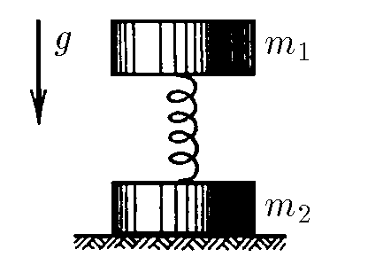
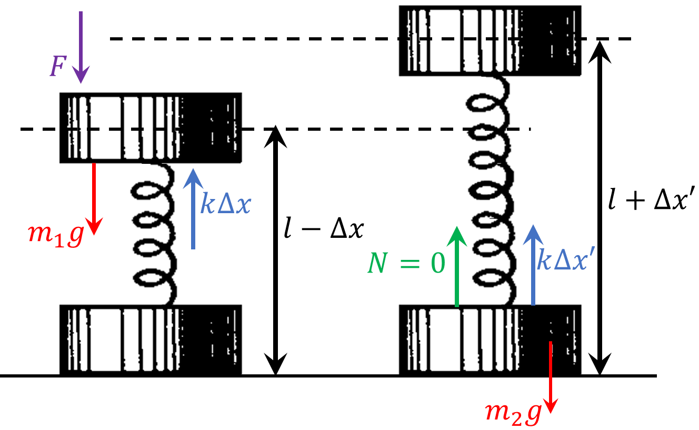

###  Statement

$2.3.46.$ What force should be applied to the upper weight of mass $m_1$ so that the lower weight of mass $m_2$, connected to the upper one by a spring, breaks off from the floor after this force ceases?

### Solution

Forces acting on the upper body in the force-less situation ($F=0$) In the case where no external force $F$ is applied, we have the equation:

$$
N+k\Delta x'=m_2g
$$

As $N=0$:

$$
\Delta x' = \frac{m_2g}{k}
$$

For the case where there is a force $F$

$$
\Delta x = \frac{F+m_1g}{k}
$$

Law of energy preservation

$$
m_1g\left(l-\Delta x\right)+\frac{k\Delta x^2}{2} = m_1g\left(l+\Delta x'\right)+\frac{k{\Delta x'}^2}{2}
$$

$$
-m_1g\left(\Delta x + \Delta x'\right)=\frac{k}{2}\left({\Delta x'}^2-{\Delta x}^2\right)
$$

The expression $ {\Delta x'}^2 - {\Delta x}^2 $ can be rewritten using the difference of squares:

$$
2m_1g=k\Delta x - k\Delta x'
$$

Substituting the previously obtained values

$$
2m_1g=F+m_1g-m_2g
$$

From where the final result could be obtained

$$
\boxed{F=m_1g+m_2g}
$$

#### Answer

$$
F=(m_1+m_2)g
$$