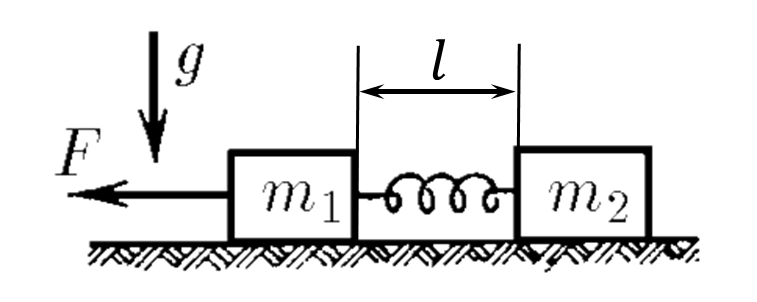
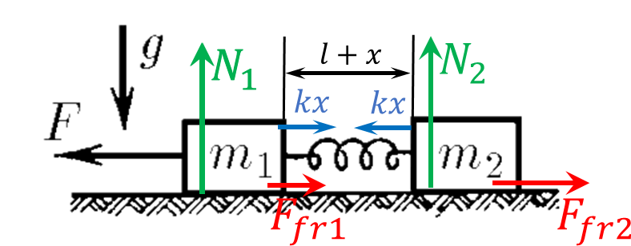

###  Statement

$2.3.48^*.$ On the horizontal plane lie two bars of mass $m_1$ and $m_2$, connected by an undeformed spring. Determine what is the smallest constant force to be applied to the left bar to move the right one, if the coefficient of friction of loads on the plane is $\mu$.

### Solution

States of equilibrium for horizontal axes

$$
F_\text{fr1} = \mu N_1 \quad (1)
$$

$$
F_\text{fr2} = \mu N_2 \quad (2)
$$

Alternatively for a vertical axes

$$
N_1 = m_1g \quad (3)
$$

$$
N_2 = m_2g \quad (4)
$$

Substituting $(3)$ and $(4)$ to the $(1)$ and $(2)$ equations

$$
F_\text{fr1} = \mu m_1g
$$

$$
F_\text{fr2} = \mu m_2g
$$

By the law of energy conservation, force $\vec{F}$ acts against the tension of the spring and against the friction force

$$
A=Fx=\Delta E
$$

Substituting the potential energy of the spring

$$
Fx = \frac{kx^2}{2} + F_\text{fr1}x
$$

$$
F= \frac{kx}{2} + \mu m_1 g \quad (5)
$$

From the state equilibrium in the steady state

$$
kx = \mu m_2 g \quad (6)
$$

After substituting $(6)$ into $(5)$, we finally get

$$
\boxed{ F = \mu g \left( m_1 +\frac{m_2}{2} \right)}
$$

#### Answer

$$
F = \mu g \left( m_1 +\frac{m_2}{2} \right)
$$