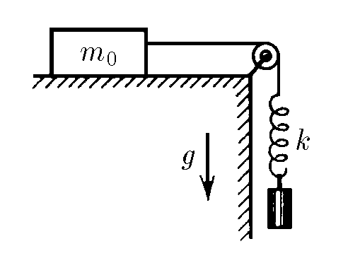
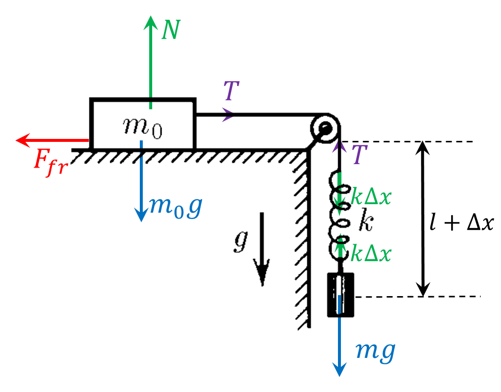

###  Statement 

$2.3.49.$ On the horizontal table is a body of mass $m_0$. A non-stretchable thread is attached to the body and thrown over the block. A spring is attached to the free end of the thread. How much weight should the load be attached to the spring so that, when descending, it can move the body of mass $m_0$ from its place, if the coefficient of friction of the body against the table is $\mu$? 

### Solution

  

State of equilibrium for body $m_0$ $$N = m_0g$$ $$F_\text{fr} = \mu N = \mu m_0 g$$ Conservation of energy for the attached weight $$\frac{k\Delta x^2}{2} = mg(l+\Delta x) - mgl$$ From where $$\frac{k\Delta x}{2} = mg$$ Considering $$T=k\Delta x \Rightarrow \mu m_0 g = 2mg$$ So, we get the desired mass $$\boxed{m=\frac{\mu m_0}{2}}$$ 

#### Answer

$$m=\frac{\mu m_0}{2}$$ 
