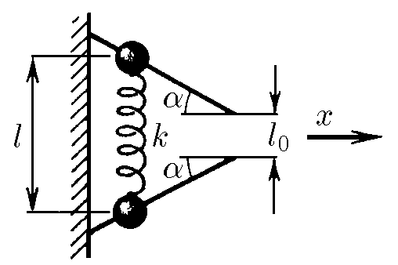

###  Statement

$2.4.16.$ Two beads of mass $m$ each, connected to each other by a spring of stiffness $k$, are held on smooth rods rigidly fixed in the wall. The spring is stretched and its length is $l$. The distance between the free ends of the rods is equal to the length of the undeformed spring. The beads are released. How fast will the spring move in the $x$-direction after the beads jump off the rod? What will be the greatest compression strain of the spring?

### Solution

Preservation of energy at the initial stage

$$
\frac{k\left(l-l_0\right)^2}{2} = 2\frac{mv^2}{2}
$$

From where

$$
v = \sqrt{\frac{k}{2m}}\left(l-l_0\right)
$$

The greatest compression will be when it has nowhere to compress $(v_y=0)$ Alternative for horizontal projection

$$
v_x=v\cos\alpha ;v_x=\text{const}
$$

After substituting

$$
\boxed{v_x = \sqrt{\frac{k}{2m}}\left(l-l_0\right)\cos\alpha}
$$

Conservation of energy with $x_\text{max}$ deformation

$$
\frac{k\left(l-l_0\right)^2}{2} = 2\frac{mv_x^2}{2} + \frac{kx_\text{max}^2}{2}
$$

From where

$$
x_\text{max}^2=\left(l-l_0\right)^2\left(1-\cos^2 \alpha\right)
$$

After using pythagorean trigonometric identity:

$$
\boxed{x_\text{max} = \left(l-l_0\right) \sin\alpha}
$$

#### Answer

$$
\begin{aligned}v_x=(l-l_0)\sqrt{k/(2m)} \cos\alpha ; x=(l-l_0)\sin\alpha .\end{aligned}
$$