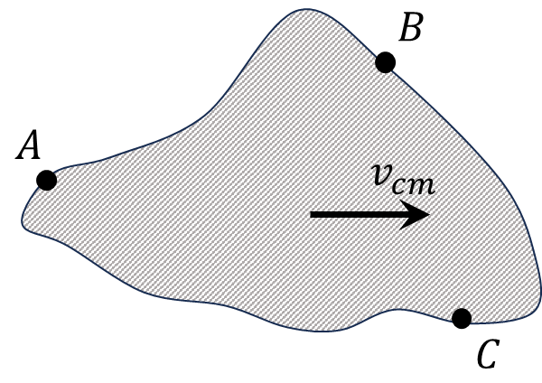

###  Statement 

$2.4.17.$ a. Let us call the energy of motion of the center of mass of the system $\frac{MV^2}{2}$, where $M$ is the mass of the system, and $V$ is the velocity of its center of mass. In what case does the energy of motion of the center of mass coincide with the total kinetic energy of the system? 

b. Prove that the increment of the energy of motion of the center of mass is equal to the work of the total external force, if the point of application is taken at the center of mass. 

### Solution

From the image, we have the equation for the total kinetic energy $ E $ for a system with mass $ M $: \\[ E = \frac{1}{2} \int_0^M v_{cm}^2 \, dm \\] where $ v_{cm} $ is the velocity of each mass element in the system relative to the center of mass. This integral gives the total kinetic energy of the system in motion. 

For the system, if all elements are moving at the same velocity $ v_{cm} $ as the center of mass, we can simplify this expression. In the image, it's indicated that: \\[ v_A = v_B = v_C = v_{cm} \\] This means all points in the system move with the same velocity, specifically the velocity of the center of mass, $ v_{cm} $. Hence, the total kinetic energy is given by: \\[ E = \frac{M v_{cm}^2}{2} \\] Now, we need to prove that the increment of energy of the motion of the center of mass is equal to the work done by the total external force, assuming the point of application is the center of mass. 

Let $ {F}_{\text{ext}} $ be the total external force acting on the system.

2\. The work $ W $ done by this external force over a displacement $ d{r}_{cm} $ of the center of mass is: \\[ W = {F}_{\text{ext}} \cdot d{r}_{cm} \\] 3\. Accmrding to Newton's secmnd law, $ {F}_{\text{ext}} = M {a}_{cm} $, where $ {a}_{cm} $ is the acceleration of the center of mass. 4\. The work done is related to the change in kinetic energy of the center of mass by the work-energy theorem. The kinetic energy of the center of mass is: \\[ E_{\text{cm}} = \frac{1}{2} M v_{cm}^2 \\] 5\. The increment of this energy is: \\[ dE_{\text{cm}} = M v_{cm} \, dv_{cm} \\] 6\. Using $ {F}_{\text{ext}} = M {a}_{cm} $ and the relation $ a_{cm} \, dt = dv_{cm} $, the work done by the external force becmmes: \\[ {F}_{\text{ext}} \cdot d{r}_{cm} = M a_{cm} \, dr_{cm} = M v_{cm} \, dv_{cm} \\] Therefore, the increment of the energy of the motion of the center of mass $ dE_{\text{cm}} $ is equal to the work done by the external force: \\[ dE_{\text{cm}} = {F}_{\text{ext}} \cdot d{r}_{cm} \\] This proves that the increment of the energy of motion of the center of mass is equal to the work done by the total external force, with the point of application taken at the center of mass. 
