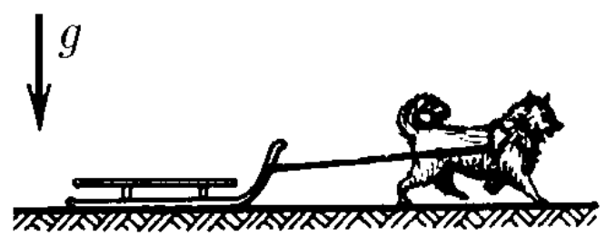

###  Statement

$2.4.20^*.$ A dog of mass m is tied with a leash of length $L$ to a sledge of mass $M > m$. At the initial moment, the dog is next to the sled. What is the greatest distance a dog can move the sledge in one jerk, if the coefficients of friction of the dog's paws and the sled runners on the horizontal surface are the same?

### Solution

The dog pulls the sled, performing work equal to \\[ A = \int_0^L F \, ds \\] Where: \\[ F = \mu mg \\] So we get: \\[ A = \mu mg L \\] According to the work-energy theorem, we know that: \\[ A = \Delta K = \frac{mv^2}{2} \\] After the dog has run a distance $L$, the leash tethered to the sled will stretch. This scenario can be analyzed as an inelastic collision. \\[ mv = (M + m)u \\] In this scenario, the work done against the frictional force represents the energy lost by the system, which results in the deceleration of the sled-dog system. This loss of kinetic energy can be quantified using the work-energy principle: \\[ \frac{(M + m) u^2}{2} = \mu (M - m) g x \\] From there we can derive: \\[ x = \frac{(M + m) u^2}{2 \mu g (M - m)} \\] We already know, that: \\[ u = \frac{m}{M + m}v \\] Finally: \\[ \boxed{x = \frac{m^2}{M^2 - m^2}L} \\]

#### Answer

$$
x = \frac{m^2}{M^2 - m^2}L
$$