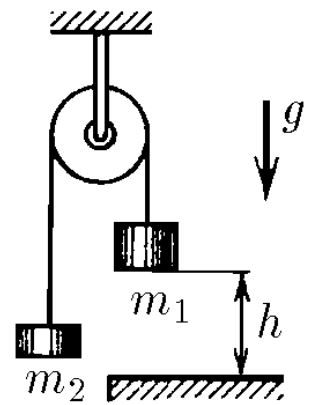

###  Statement

$2.4.34$ Two loads of mass $m_1$ and $m_2$ ($m_1 > m_2$) are connected by a thread thrown over a fixed block. At the initial moment, the load of mass $m_1$ is held at a height $h$ above the floor. Then it is released without a push. How much heat will be released when the load hits the floor? The impact is absolutely inelastic.

### Solution

Applying Energy Conservation Law:

$$
m_1 g h = Q + m_2 g H\;(1)
$$

where $Q$ is lost energy by heat and $H$ is the height achieved by body of mass $m_2$ after the impact of body of mass $m_1$, and is given by,

$$
H = h + \frac{v^2}{2g}\;(2)
$$

Why? Potential energy of body 1 is converted in kinetic energy of body 1 and kinetic energy of body 2 with same velocity due to the constraint ($v_1=v_2=v$), after totally inelastic collision with ground, part of this energy is transformed in heat and the other one in potential energy for body 2, which behaves as a projectile launched vertically upwards from height $h$. For determining this velocity $v$, it's necessary to know what acceleration did the system have before impact. Applying Newton Second Law, for body 1:

$$
m_1 g - T = m_1 a \;(3)
$$

and for body 2,

$$
T - m_2 g = m_2 a\;(4)
$$

Suming up equations (3) and (4) side by side,

$$
a = \frac{m_1-m_2}{m_1+m_2}g\;(5)
$$

As $h = \frac{v^2}{2a}$, so,

$$
v = \sqrt{2ah}\;(6)
$$

Substituting (5) into (6),

$$
v = \sqrt{2gh\left(\frac{m_1-m_2}{m_1+m_2}\right)}\;(7)
$$

Putting (7) into (2)

$$
H = \frac{2m_1}{m_1+m_2}h\;(8)
$$

Finally, substituting (8) into (1) and separating $Q$,

#### Answer

$$
Q = m_1gh \frac{m_1-m_2}{m_1+m_2}
$$