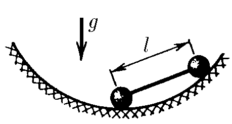
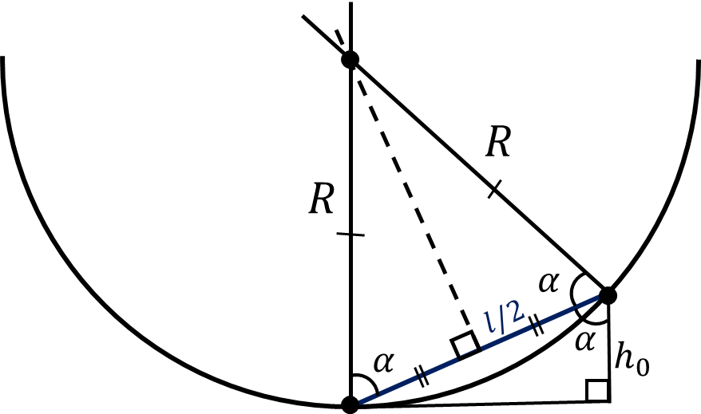

###  Statement

$2.4.35.$ In a spherical bowl of radius $R$, hold the dumbbell in the position when one of the balls is at the bottom of the bowl, and then release it. How much heat will be released by the time the dumbbell stops moving due to the low friction between the bowl and the dumbbell? Dumbbell length $l$, weight of each ball $m$.

### Solution

From the figure

$$
R\cos\alpha = \frac{l}{2}
$$

Whereas

$$
\cos\alpha = \frac{l}{2R}
$$

In the meantime, the vertical distance of the balls

$$
h_0=\frac{l^2}{2R}
$$

The potential energy of the system is

$$
E_{p0} = mg\cdot 0 + mgh_0
$$

$$
E_{p0} = mgh_0
$$

From the geometry

$$
h'+h=R
$$

Where $h'$ could be found as

$$
h' = R\sin\alpha
$$

From the Figure 2

$$
\sin\alpha = \sqrt{1-\frac{l^2}{4R^2}}
$$

$$
h' = R \sqrt{1-\frac{l^2}{4R^2}}
$$

$$
h = R-h' = R\left(1-\sqrt{1-\frac{l^2}{4R^2}}\right)
$$

The potential energy of the system is shown on Figure 2

$$
E_p = 2mgh
$$

$$
E_p = 2mgR\left(1-\sqrt{1-\frac{l^2}{4R^2}}\right)
$$

Heat that will be released

$$
Q = E_{p0} - E_p
$$

$$
Q = \frac{mgl^2}{2R} - 2mgR\left(1-\sqrt{1-\frac{l^2}{4R^2}}\right)
$$

After mathematical transformations

$$
\boxed{Q = 2mgR\left(1-\sqrt{1-\frac{l^2}{4R^2}}\right)\sqrt{1-\frac{l^2}{4R^2}}}
$$

#### Answer

$$
Q=2mgR(1-\sqrt{1-l^2/(4R^2)} )\sqrt{1-l^2/(4R^2)}
$$