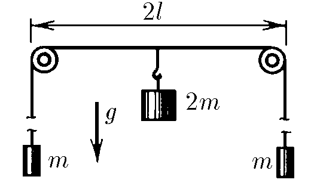
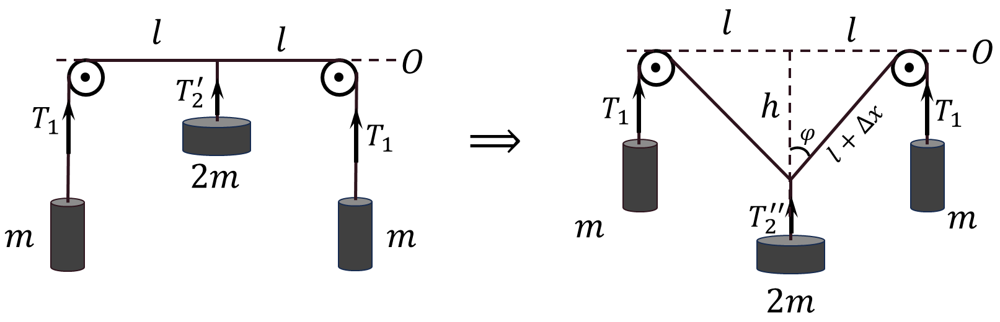

###  Statement

$2.4.9^*.$ At the ends of a long thread, weights of mass $m$ each are suspended. The thread is spanned over two light little blocks located at a distance of $2l$ from each other. A $2m$ weight is attached to it in the middle between the blocks, and the system starts moving. Find the speed of loads after a sufficiently long period of time has elapsed.

### Solution

From the geometry of the drawing, a trigonometric expression can be obtained by

$$
\tan\varphi=\frac{l}{h}\tag{1}
$$

$$
\sin\varphi=\frac{l}{\sqrt{l^2+h^2}};\quad\cos\varphi=\frac{h}{\sqrt{l^2+h^2}}\tag{2}
$$

Over the long period of time the $2m$ weight would go down infinitely ($h\to \infty$) From $(1)$, we obtain that as $h$ increases $\tan\varphi$ decreases

$$
\tan\varphi \to 0;\quad\varphi \to 0
$$

For the small angle $\varphi$ we could use an approximation to the second order of magnitude

$$
\sin\varphi \approx\tan\varphi\approx\varphi;\quad\cos\varphi\approx 1
$$

From the geometry of the figure, the length of the thread

$$
\sqrt{l^2+h^2}=l+\Delta x
$$

by the Pythagorean theorem, the change in the bottom of the thread connecting $2m$

$$
\Delta x = \sqrt{l^2+h^2}-l
$$

Similarly, from the geometry of the figure

Considering $\sin\varphi\approx\tan\varphi$ and $h\gg l$, we obtain

$$
\sqrt{l^2+h^2}\approx h\Rightarrow \boxed{l=h-\Delta x}\tag{2}
$$

$L_1,~L_2$ — Length of threads at the initial moment

Conservation of the mechanical energy $(dE_p+dE_k=0)$

Two weights with mass $m$ went up to $\Delta x$ and the $2m$ went down $h$, making change in potential energy

$$
dE_p=-2mgh+2\cdot mg\Delta x
$$

In the meantime, the velocities of $m$ and $2m$ bodies become $v_1$ and $v_2$, respectively, making total kinetic energy of the system

$$
dE_k = 2\frac{mv_1^2}{2}+\frac{2m\cdot v_2^2}{2}
$$

Substituing into equations of conservation of the mechanical energy

$$
dE_p+dE_k=0\Leftrightarrow -2mgh+2\cdot mg\Delta x+2\frac{mv_1^2}{2}+\frac{2m\cdot v_2^2}{2}=0
$$

$$
v_1^2+v_2^2=2g\left(h-\Delta x\right)\tag{3}
$$

By the Newton's second law for the $m$ weight

$$
ma=T-mg
$$

Similarly, for the $2m$ weight

$$
2ma^*=2mg-2T\cos\varphi\approx2mg-2T\Leftrightarrow
$$

$$
\Leftrightarrow ma^*=mg-T
$$

As they are connected by the same inextensible thread, their acceleration will be equal

$$
\left|a\right|=\left|a^*\right|\Rightarrow v=v^*
$$

Given that the system is being run from a stationary state $(v_0=v_0^*=0)$, let's substitute into $(3)$

$$
2v^2=2g\left(h-\Delta x\right)
$$

Taking into consideration $(2)$

$$
v^2=gl\Rightarrow \boxed{v=\sqrt{gl}}
$$

#### Answer

$$
v=\sqrt{gl}
$$