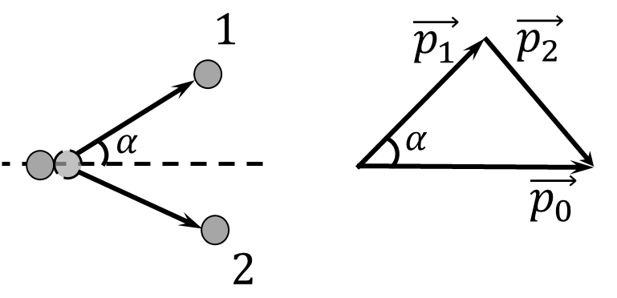

###  Statement 

$2.5.17^*.$ A heavy particle of mass $m_1$ collides with a resting light particle of mass $m_2$. What is the greatest angle that a heavy particle can deflect as a result of an elastic impact? 

### Solution

Following from the law of conservation of energy $$\frac{p_1^2}{2m_1}+\frac{p_2^2}{2m_2}=\frac{p_0^2}{2m_1}$$ From where $$p_2^2=\frac{m_2}{m_1}\left(p_0^2-p_1^2\right)\quad\text{(1)}$$ From the cosine theorem $$p_2^2=p_1^2+p_0^2-2p_1p_0\cos\alpha$$ Substituting into $\text{(1)}$: $$\frac{m_2}{m_1}p_0^2-\frac{m_2}{m_1}p_1^2=p_1^2+p_0^2-2p_1p_0\cos\alpha$$ Let's regroup this into a quadratic equation 

$$p_1^2\left(1+\frac{m_2}{m_1}\right)-2p_0p_1\cos\alpha +p_0^2\left(1-\frac{m_2}{m_1}\right)=0$$

Solving relative to $p_1$ 

$$p_1=\frac{2p_0\cos\alpha\pm \sqrt{4p_0^2\cos^2 \alpha -4p_0^2\left(1-\frac{m_2^2}{m_1^2}\right)}}{2\left(1+\frac{m_2}{m_1}\right)}$$

Since $\Delta = 0$ $$\cos^2 \alpha =1-\frac{m_2^2}{m_1^2}$$ From where we find the required ratio $$\frac{m_2^2}{m_1^2}=1-\cos^2 \alpha =\sin^2 \alpha$$ $$\boxed{\sin\alpha =\frac{m_2}{m_1}}$$ 

#### Answer

$$\sin\alpha =m_2/m_1$$ 
