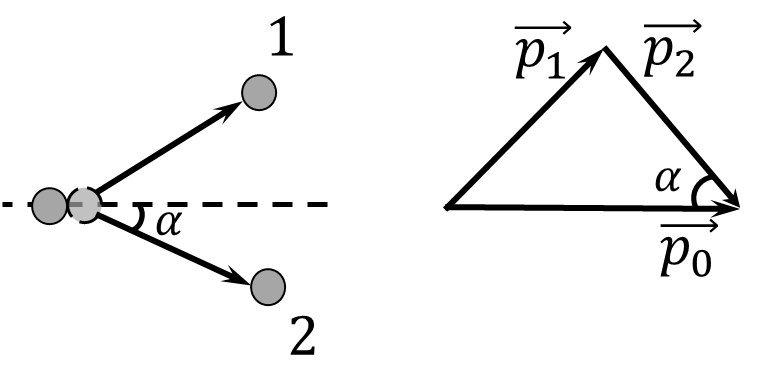

###  Statement

$2.5.18^*.$ A particle of mass $m_1$ flew at a velocity $v$ on a stationary particle of mass $m_2$, which, after an elastic impact, flew at an angle $\alpha$ to the initial direction of movement of the incoming particle. Determine the velocity of a particle of mass $m_2$ after impact.

### Solution

Following from the law of conservation of energy

$$
\frac{p_0^2}{2m_1}=\frac{p_1^2}{2m_1}+\frac{p_2^2}{2m_2}
$$

From where

$$
p_1^2=p_0^2-p_2^2\frac{m_1}{m_2}
$$

From the cosine theorem

$$
p_1^2=p_2^2+p_0^2-2p_2p_0\cos\alpha
$$

From where

$$
p_2\left(1+\frac{m_1}{m_2}\right)=2p_0\cos\alpha\tag{1}
$$

By definition of momentum

$$
\left\\{\begin{matrix} p_0=m_1v \\\ p_2=m_2u \end{matrix}\right.
$$

Substituting into $(1)$ expression

$$
m_2u\left(1+\frac{m_1}{m_2}\right)=2m_1v\cos\alpha
$$

$$
u(m_1+m_2)=2m_1v\cos\alpha
$$

$$
\boxed{u=v\frac{2m_1\cos\alpha}{m_1+m_2s}}
$$

#### Answer

$$
u=v\frac{2m_1\cos\alpha}{m_1+m_2}
$$

### Alternative solution

This phenomenon is also knowned as Compton scattering

Let's write the law of conservation of momentum:

$$
\left\\{\begin{matrix} X\text{: }m_1v=m_1v_1\cos\beta +m_2v_2\cos\alpha\\\ Y\text{: }m_1v_1\sin\beta =m_2v_2\sin\alpha\\\ \end{matrix}\right.
$$

Let's

$$
\xi =\frac{m_2}{m_1}
$$

From where:

$$
v_1\sin\beta =\xi v_2\sin\alpha
$$

$$
v=v_1\cos\beta +\xi v_2\cos\alpha
$$

We could find $\cos\beta$ from first expression:

$$
\cos\beta =\sqrt{1-\sin^2 \beta}
$$

$$
\cos\beta =\sqrt{1-(\xi\frac{v_2}{v_1}\sin\alpha )^2}
$$

The law of conservation of energy:

$$
\frac{m_1v^2}{2}=\frac{m_1v_1^2}{2}+\frac{m_2v_2^2}{2}
$$

From where

$$
v_1^2=v^2-\xi v_2^2
$$

From the other hand:

$$
(v-\xi v_2\cos\alpha )^2=v_1^2\cos^2 \beta
$$

$$
(v-\xi v_2\cos\alpha )^2=v_1^2\cdot(1-(\xi\frac{v_2}{v_1}\sin\alpha )^2)
$$

$$
(v-\xi v_2\cos\alpha )^2=v_1^2-(\xi v_2\sin\alpha )^2
$$

$$
v^2 - 2\xi vv_2\cos\alpha =v_1^2-\xi^2 v_2^2
$$

From where

$$
v_2^2\xi (1+\xi )=2\xi vv_2\cos\alpha
$$

$$
v_2=v\frac{2\cos\alpha}{1+\xi}
$$

And, finally

$$
\boxed{v_2=v\frac{2m_1\cos\alpha}{m_1+m_2}}
$$

#### Answer

$$
v_2=v\frac{2m_1\cos\alpha}{m_1+m_2}
$$