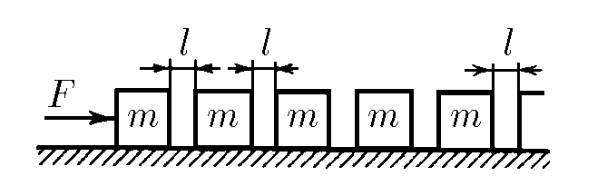

###  Statement 

$2.5.38^*.$ In one straight line on a smooth horizontal plane with equal intervals there are bars of mass $m$ each. A constant horizontal force $F$ is applied to the first of the bars. Determine the speed of the bars before and immediately after the nth impact. Consider the speed limit value for $n$ tending to infinity, if the width of the gaps between the bars is $l$. The blows of the bars are absolutely inelastic. 

### Solution

Let's consider 1st and 2nd collision **First collision** : From the law of conservation of energy $$v_1^2=2a_1l$$ Considering Newton's 2nd law ($a_1=\frac{F}{m}$) $$v_1^2=\frac{2Fl}{m}$$ Where $v_1$ is the velocity before the collision Law of conservation of momentum $$mv_1=2mv_1'$$ $$v_1=\sqrt{\frac{Fl}{2m}}\quad\text{(1)}$$ **Second collision** : From the law of conservation of energy $$v_2^2=v_1^2+2a_2l$$ Likewise, considering $a_2=\frac{F}{2m}$: $$v_2^2=\frac{Fl}{2m}+\frac{Fl}{m}=\frac{3Fl}{2m}$$ $$v_2=\sqrt{\frac{3Fl}{2m}}\quad\text{(2)}$$ Where $v_2$ is the velocity after the collision From $v_1$ and $v_2$, we can see that the velocity index is the same as the coefficient in front of the mass and $\text{index}+1$ at the top Thus leading to the following recurrence relation $$\boxed{v_n=\sqrt{\frac{Fl}{m}\left( 1+ \frac{1}{n} \right)}}\quad\text{(3)}$$ Where $v_n$ is the velocity before the $n^\text{th}$ collision Law of conservation of momentum of the $n^\text{th}$ collision $$v_nmn=u_nm(n+1)$$ $${u_n=\frac{1}{1+\frac{1}{n}}v_n}$$ Substituting into the expression $\text{(3)}$: $$\boxed{u_n=\sqrt{\frac{Fl}{m\left(1+\frac{1}{n}\right)}}}$$ When $n\to\infty$, $\frac{1}{n}\to0$: $$\lim_{n\to\infty}\frac{1}{n}=0$$ Whence it follows that the velocity $u_n$ after $n^\text{th}$ collision, where $n\to\infty$, will be equal to $$\boxed{u_n=\lim_{n\to\infty}\sqrt{\frac{Fl}{m\left(1+\frac{1}{n}\right)}}=\sqrt{\frac{Fl}{m}}}$$ 

#### Answer

$$v_n=\sqrt{\frac{Fl}{m}(1+1/n)}$$ $$u_n=\sqrt{\frac{Fl}{m(1+1/n)}}$$ $$v_n\to\sqrt{\frac{Fl}{m}}\text{ with }n\to\infty.$$ 
