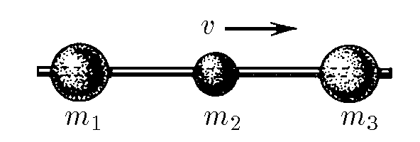

###  Statement

$2.5.9^*.$ Beads of mass $m_1$, $m_2$, $m_3$ can slide along the horizontal spoke without friction, with $m_1 \gg m_2$ and $m_3 \gg m_2$. Determine the maximum velocities of the extreme beads, if at first they were at rest, and the middle bead had a velocity $v$. The blows are elastic.

### Solution

Let's consider the velocity of the center of mass $v_c$:

$$
v_c = \frac{m_2 v}{m_1 + m_2 + m_3}
$$

According to the problem we know that $m_2 \ll m_1$ and $m_2 \ll m_3$, hence:

$$
v_c \approx 0
$$

Since the velocity of the center of mass is approximately zero, it follows that:

$$
m_1 v_1 = m_3 v_3 \tag{1}
$$

Now let's write down the law of conservation of energy, since the collisions are elastic:

$$
\frac{m_2 v^2}{2} = \frac{m_1 v_1^2}{2} + \frac{m_3 v_3^2}{2} \tag{2}
$$

By expressing the velocity $v_3$ in equation (1) and substituting it into equation (2), we obtain the answer:

$$
\boxed{v_1 = v \sqrt{\frac{m_2 m_3}{m_1 (m_1 + m_3)}}}
$$

and

$$
\boxed{v_3 = v \sqrt{\frac{m_2 m_1}{m_3 (m_1 + m_3)}}}
$$

#### Answer

$$
v_1=v\sqrt{\frac{m_2m_3}{m_1(m_1+m_3)}}; \quad v_3=v\sqrt{\frac{m_2m_1}{m_3(m_1+m_3)}}
$$