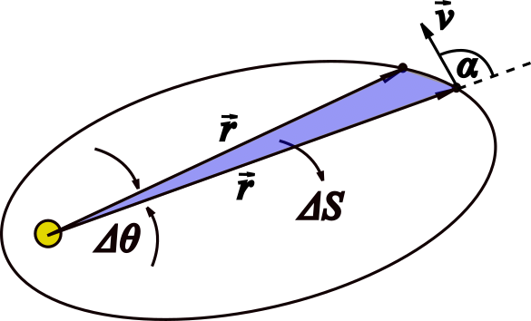

###  Statement

$2.6.36^*$ In the case of a central force acting on a body, the radius vector drawn to it from the center describes equal areas at regular intervals. (This, in fact, is Kepler's second law with respect to the motion of the planets.) What area will the radius vector drawn from the Sun to the planet describe in time $t$, if at the initial moment the distance from it to the Sun is $r$, the speed is $v$, and the angle between the speed of the planet and the radius vector is $\alpha$?

### Solution

Graphically, it can be seen that

$$
\Delta S = \frac{r^2\Delta \theta}{2}\tag{1}
$$

considering a small variation of angle swept by radiovector. But,

$$
\Delta \theta = \omega~\Delta t\tag{2}
$$

As angular momentum $L$ is related to angular velocity, $L = I\omega$, where $I$ is inertia's momentum, in this case $I = mr^2$, so

$$
\omega = \frac{L}{mr^2}\tag{3}
$$

By definition, $\vec{L} = m \vec{r}\times\vec{v}$, then

$$
L = mrv\sin{\alpha}\tag{4}
$$

Putting (4) into (3)

$$
\omega = \frac{v}{r}\sin{\alpha}\tag{5}
$$

Substituting (5) into (2)

$$
\Delta \theta = \frac{v\Delta t}{r}\sin{\alpha}\tag{6}
$$

From (6) and (1)

$$
\Delta S = \frac{rv\Delta t}{2}\sin{\alpha}
$$

where $\Delta S = S - S_0 = S$ ($S_0=0$) and $\Delta t = t - t_0 = t$ ($t_0=0$). Finally,

#### Answer

$$
S = \frac{rvt}{2}\sin{\alpha}
$$