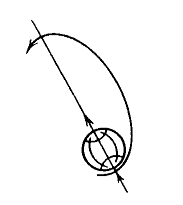
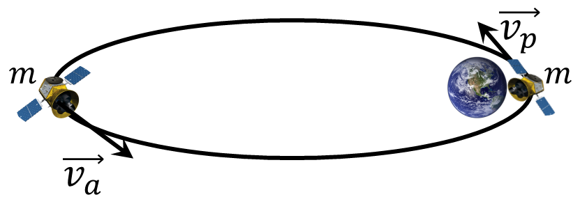

###  Statement

$2.6.37.$ The Molniya-1 communications satellite has a perigee over the southern hemisphere of the Earth at an altitude of about $500$ km, and an apogee at an altitude of about $40,000$ km over the northern hemisphere. What is the ratio of the angular velocities of rotation of this satellite at perigee and apogee?

### Solution

Law of energy preservation

$$
\frac{mv^2_a}{2}-G\frac{mM}{R_a}=\frac{mv^2_p}{2}-G\frac{mM}{R_p}\quad (1)
$$

Conservation of angular momentum

$$
mv_aR_a=mv_pR_p
$$

From where velocity at closest position to the planet, at perigee

$$
v_p=v_a\frac{R_a}{R_p}\quad (2)
$$

Let's substitute value of $v_p$ to $(1)$:

$$
\frac{v_a^2}{2} = \frac{GMR_p}{R_a(R_a+R_p)}
$$

From where, we could value of the velocity at farthest position to the planet, at apogee

$$
v_a=\sqrt{\frac{2GMR_p}{(R_a+R_p)R_a}}
$$

Considering dependence $v_p(v_a)$ from $(2)$, we obtain

$$
v_p=\sqrt{\frac{2GMR_a}{(R_a+R_p)R_p}}
$$

By definition of angular velocity

$$
\omega_a = \frac{v_a}{R_a}=\sqrt{\frac{2GMR_p}{(R_a+R_p)R_a^3}}
$$

$$
\omega_p = \frac{v_p}{R_p}=\sqrt{\frac{2GMR_a}{(R_a+R_p)R_p^3}}
$$

The desired relationship could be found by dividing one equation on another

$$
\xi = \frac{\omega_p}{\omega_a} = \frac{R_a^2}{R_p^2}\quad (3)
$$

Considering the radius of the Earth

$$
R_a=R_a'+R_e
$$

$$
R_p=R_p'+R_e
$$

After substituting into $(3)$, we are getting

$$
\boxed{\xi = \frac{(46400\text{ km})^2}{(6900\text{ km})^2} \approx 45}
$$

#### Answer

$$
\frac{\omega_p}{\omega_a}\approx 45
$$