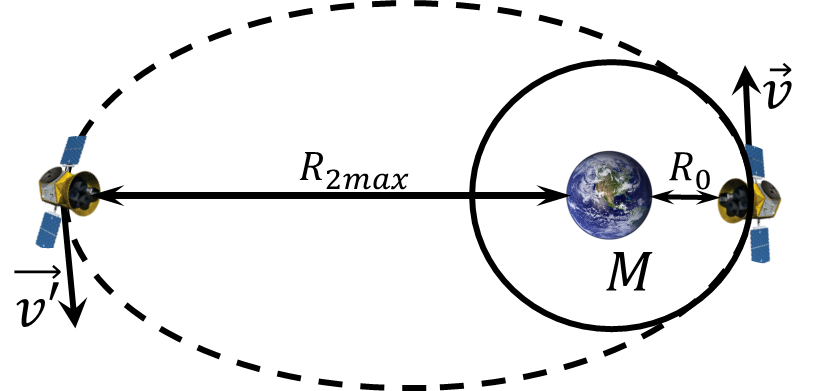

###  Statement

$2.6.41^*.$ Two probes are launched from an orbital station moving at a speed of $u$ in a circular orbit around the planet. The initial velocity of the probes relative to the planet is $v$ ($\sqrt{2} u > v > u$). One probe moves in the direction of the planet's radius; the initial velocity of the other probe is perpendicular to its radius. Find the ratio of the maximum possible distances from the probes to the center of the planet.

### Solution

Let's consider two cases:

1) Velocity $\vec{v}$ in radial direction:

For this case, let's consider preservation of energy

$$
\frac{mv^2}{2}-\frac{GmM}{R_0}=\frac{m{v'}^2}{2}-\frac{GmM}{R_1}
$$

Analyzing the components, when $v'\to 0,$ $R_1$ tends to the maximum value $R_1 \to R_\text{1max}$

$$
\frac{mv^2}{2} - \frac{GmM}{R_0} = - \frac{GmM}{R_\text{1max}}
$$

$$
\frac{1}{2}v^2 = GM \left( \frac{1}{R_0} - \frac{1}{R_\text{1max}} \right)
$$

2) The velocity $v$ is perpendicular to the radius

From Kepler's first law, the orbit will be an ellipse

_$R_0$ - radius of circular orbit $R_1$ - maximum orbit at radial velocity $R_2$ - maximum orbit at perpendicular velocity_

Similarly, the preservation of energy

$$
\frac{mv^2}{2}-\frac{GmM}{R_0}=\frac{m{v'}^2}{2}-\frac{GmM}{R_\text{2max}}\quad(1)
$$

Conservation of angular momentum

$$
mvR_0=m{v'}R_\text{2max}
$$

From where

$$
v'=v\frac{R_0}{R_\text{2max}}\quad(2)
$$

Substituting $(2)$ into $(1)$

$$
\frac{v^2}{2}\left(1+\frac{R_0}{R_\text{2max}}\right) = GM \frac{1}{R_0}
$$

Now, let's consider circular motion:

Given the centripetal acceleration $a=\frac{u^2}{R_0}$, the presence of rotational motion of which causes centrifugal force, compensating gravitational force, in the equilibrium condition.

$$
\frac{mu^2}{R_0}=\frac{GmM}{R_0^2} \Leftrightarrow \frac{GM}{R_0}=u^2
$$

Substituting into the final formula of motion

$$
\frac{1}{2}v^2=u^2\left(1-\frac{R_0}{R_\text{1max}}\right)
$$

$$
\frac{1}{2}v^2\left(1+\frac{R_0}{R_\text{2max}}\right)=u^2
$$

Transforming the obtained expressions

$$
R_0=R_\text{1max}\cdot\left(1-\frac{1}{2}\frac{v^2}{u^2}\right)=R_\text{2max}\cdot\left(2\frac{u^2}{v^2}-1\right)
$$

$$
R_\text{1max}\cdot \frac{2u^2-v^2}{2u^2} = R_\text{2max}\cdot \frac{2u^2-v^2}{v^2}
$$

From where we express the ratio of the maximum possible distances from the probes to the center of the planet

$$
\boxed{\frac{R_\text{1max}}{R_\text{2max}}=\frac{2u^2}{v^2}}
$$

#### Answer

$$
R_1/R_2=2u^2/v^2
$$