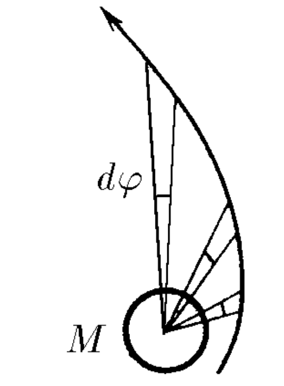
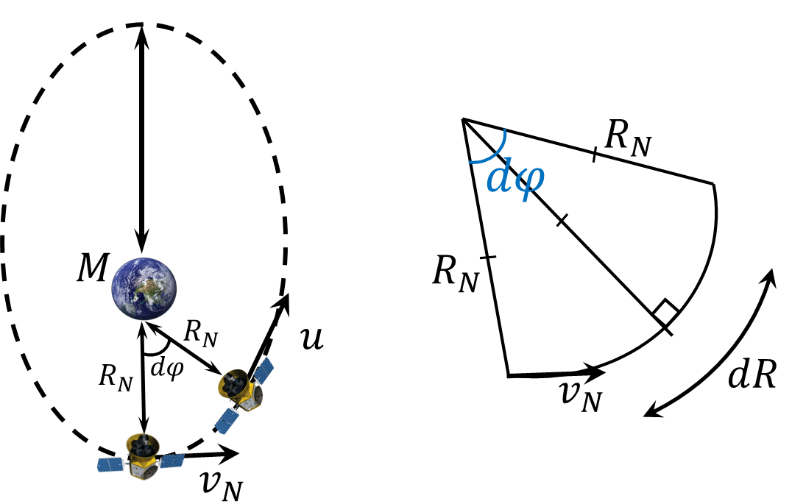

###  Statement 

$2.6.42^*.$ The plane of the satellite's orbit is divided into sectors with a common vertex in the center of the planet of mass $M$ and the same small solution angles $d \varphi$. Find the change in the satellite's speed as it passes through each sector, if its speed is in the pericenter $v_p$, and the distance from the satellite to the center of the planet is in the pericenter $r_p$. 

### Solution

  Change in speed over a short period of time 

For a short time, $dt$, the body moves along the arc of the circle of arc $d\varphi$ with radius-curvature of the trajectory $R_n$.

Newton's second law for an external force, the gravitational force $$ma=\frac{GmM}{R_n^2}$$ By definition of acceleration $$a=\frac{dv}{dt}\Rightarrow \frac{dv}{dt}=\frac{GM}{R_n^2}\quad (1)$$ In a small amount of time $$dR=v_ndt\quad (2)$$ By definition the arc length of the circle corresponding to the angle $d\varphi$ $$dR=d\varphi \cdot R_n\quad (3)$$ After substituting $(2)$ and $(3)$ into $(1)$ $$\frac{dv}{dR}v_n=\frac{GM}{R_n^2}\Rightarrow \frac{dv}{d\varphi}v_n=\frac{GM}{R_n}$$ After the transformation, we can get a change in the satellite's speed $$\boxed{dv=\frac{GM\cdot d\varphi}{R_nv_n}}$$ 

### Alternative solution

Kepler's second law states that the speed of sweeping out a sector area is constant, i.e. $$ \frac{dS}{dt}=\text{const} $$ We know the satellite's distance $r_n$ at the pericenter and its velocity $v_n$ at this point. At the pericenter, over a small interval $dt$, a very small sector is swept out, which can be considered an isosceles triangle with the thigh length $r_n$ and the base $v_n dt$. So at this point $dS_n=\frac{1}{2}v_ndt \cdot r_n$, or $$ \frac{dS}{dt}=\frac{v_nr_n}{2}. $$ Now let's move on to the question of the change in speed with each passage of the angle $d\varphi$. If at the moment the distance between the satellite and the planet is equal to $r$, then $$ dS=\frac{1}{2}r^2 d\varphi. $$ Newton's second law is written as follows: $$ \frac{dv_r}{dt}=\frac{GM}{r^2}=\frac{GM}{v_n r_n}\frac{d\varphi}{dt}, $$ where the index $r$ denotes the change in the radial component of the velocity in the direction toward the center of the planet. From here we obtain the final answer: $$ dv=\frac{GM}{v_n r_n}d\varphi. $$ 

#### Answer

$dv=\gamma Md\varphi/(v_{\mathrm{n}}r_{\mathrm{n}})$. The vector $dv$ is directed towards the centre of the planet 
