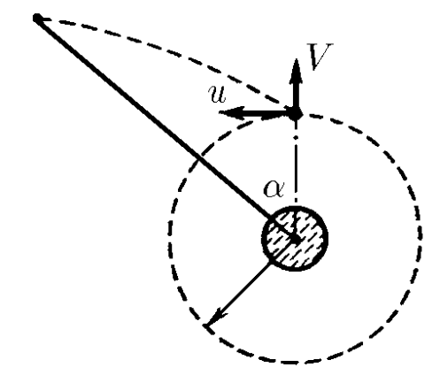

###  Statement 

$2.6.43^*.$ From an orbital station having a circular orbit of radius $R$ and velocity $u$, the probe was launched, giving it an instantaneous additional velocity $V$ in the radial direction Prove that when the probe and the station are seen from the center of the planet at the same angle to the direction of the launch point, their velocities still differ by $V$. At what distance from the center of the planet is the probe located when this observation angle is equal to $\alpha$? 

### Solution

First, let's note that knowledge of the trajectory is not necessary to solve the problem. In general, it is a curvilinear segment that is part of a conic section (ellipse/parabola/hyperbola, depending on the initial velocity).

Recall the derivation of the formula from [2.6.42*](../2.6.42). Since the specific angular momentum at the starting point, $l=uR$ is the same for both the station and the probe, the changes in their velocities $\Delta v$ are the same if the swept angle is $\int d\varphi = \alpha$ for both satellites. Then it is easy to write down the law of conservation of angular momentum for the probe and get the answer.

$$ d\vec v=-\frac{GM}{v_n r_n}d\varphi\cdot \hat r. $$ The total change in velocity is summed up as follows: $$ \Delta\vec v = -\frac{GM}{V_nr_n}\int\hat rd\varphi, $$ that is, it is necessary to take into account the change in the direction of this radial increment at each point due to the rotation of the basis vector $\hat r$. But this change $\Delta\vec v$ is exactly the same for both the probe and the station when in sum they sweep out the angle $\alpha$. The most important thing is that this integration does not depend on the distance $r$ of the probe/station to the planet, but depends only on the angular position of the object. In other words, in Cartesian coordinates $\hat r = \hat x\sin\varphi + \hat y\cos\varphi$, and such coordinates, being tied to the probe, do not rotate, which means that the integration goes into $$ \int\hat rd\varphi = \hat x\int\sin\varphi d\varphi +\hat y\int\cos\varphi d\varphi. $$ The total velocity of the probe is made up of the vector sum of the velocities $\vec u + \vec V + \int d\vec v$. Without the additionally communicated speed $\vec u + \int d\vec v$, the station would essentially move in a circle, and $$ \frac{dv}{dt}=\frac{u^2}{R} $$ Although $d\vec v$ is directed to the center of the planet, due to the ship's motion along a certain trajectory, its total angular momentum generated is, generally speaking, not equal to zero. That is, when writing the law of conservation of angular momentum, it is necessary, firstly, to take into account the emerging angular momentum arm $r\sin\alpha$ for the velocity $\vec V$ and, secondly, to take into account that the angular momentum component for the velocity $\vec u + \int d\vec v$ is equal to $ur$ (because $\vec u + \int d\vec v$ will always be perpendicular to the radius vector $\vec r$).

We understand that the integration is carried out from $0$ to $\alpha$ simultaneously for both the probe and the station. This means that their vector increments $\Delta\vec v$ are indeed equal – then their difference remains $\vec V$. The station, although it receives a vector increment $\Delta\vec v$ after some time, simply turns along its circular trajectory, maintaining its velocity $u$ in absolute value and remaining perpendicular to $\hat r$. This again confirms previous idea that $\vec u+∫d\vec v$ will always be perpendicular to the radius vector $\vec r$.

Now, we can get

$$ uR=ur-V\cdot r\sin\alpha , $$ From where we express and obtain $$ \boxed{r=\frac{R}{1-\frac{V}{u} \sin\alpha}} $$ 

#### Answer

The moment of velocity (vector product of velocity and radius vector drawn from the center of orbit) of the probe is the same as the moment of velocity of the station; if the probe and station rotate by the same angle, the velocity vectors will change equally. From the constancy of the moment of velocity of the probe: $up = (v − V \sin\alpha )r$ it follows that $r = p/(1 − \varepsilon \sin\alpha )$, where $\varepsilon = V /u$. For $\varepsilon < 1$ the trajectory of the probe is an ellipse, for $\varepsilon = 1$ it is a parabola, for $\varepsilon > 1$ it is a hyperbola. 
