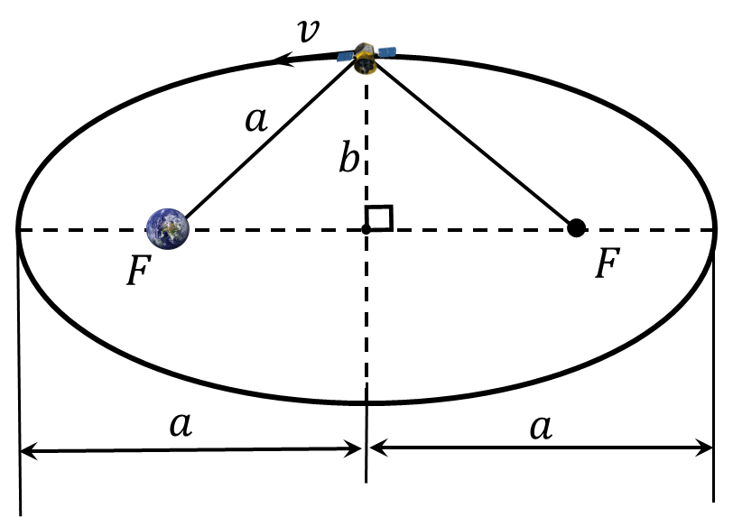

###  Statement 

$2.6.45^*.$ The segment connecting the pericenter and apocenter of an elliptical orbit is called the major axis. The ellipse is symmetric relative to it. The segment connecting the points of the orbit farthest from the major axis is called the minor axis. It is perpendicular to the major axis and is also the axis of symmetry of the ellipse. Using the issue conditions [2.6.43](../2.6.43), find the probe velocity at the vertices of the minor axis. Express this velocity in terms of the length of the semimajor axis a and the mass of the planet $M$. 

### Solution

From the conservation of energy $$E= \frac{mv^2}{2}-\frac{GmM}{a}$$ $$E=-\frac{GmM}{2a}$$ Equating both expressions $$\frac{mv^2}{2}-\frac{GmM}{a}=-\frac{GmM}{2a}$$ $$\frac{mv^2}{2}=\frac{GmM}{2a}$$ Whence the required velocity $$\boxed{v=\sqrt{\frac{GM}{a}}}$$ 

#### Answer

This velocity is parallel to the major axis and perpendicular to the vector $V$, therefore $V_0 = \sqrt{u^2 - V^2}$. Since \\[ a = \frac{1}{2} \left( r_a + r_p \right) = \frac{p u^2}{u^2 - V^2}, \\] and $a = \frac{G M}{V_0^2}$(from the equation $ u^2 / p = G M / p^2 $ for a circular orbit, it follows that $ p u^2 = G M $, finally \\[ V_0 = \sqrt{\frac{G M}{a}}. \\] 
