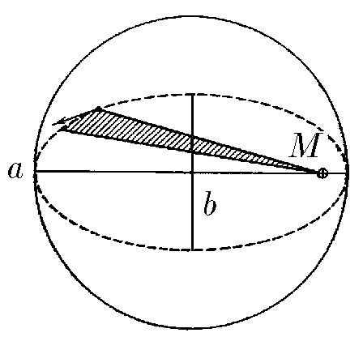
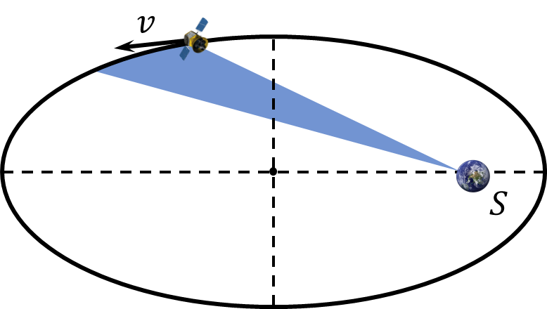

###  Statement

$2.6.46^*.$ A satellite moves around a planet of mass $M$ in an ellipse with semi-major and minor axes $a$ and $b$. Determine the area that the radius vector drawn from the center of the planet to the satellite "sweeps" per unit time. Find the period of rotation of the satellite.

### Solution

Kepler's Third Law

$$
\frac{T^2}{a^3}=\frac{4\pi^2}{GM}
$$

From where

$$
\boxed{T=2\pi\sqrt{\frac{a^3}{GM}}}
$$

Kepler's Second Law

$$
\frac{dS}{dt}=\text{const};\quad \frac{dS}{dt}=v
$$

$$
v=\frac{S}{T}=\frac{\pi ab}{2\pi}\cdot\sqrt{\frac{GM}{a^3}}
$$

From here the velocity $v$ could be found as

$$
\boxed{v=\frac{1}{2}b\cdot\sqrt{\frac{GM}{a}}}
$$

### Alternative solution

The radius of curvature of the orbit at the apex of the major axis of the ellipse \\[ R = \frac{a}{k^2} = \frac{b^2}{a}. \\] Therefore \\[ \frac{v^2}{R} = \frac{v^2 a}{b^2} = \frac{G M}{r^2} \rightarrow vr = \sqrt{G M \frac{b^2}{a}}, \\] \\[ \frac{dS}{dt} = \frac{1}{2}vr = \frac{1}{2}b \sqrt{\frac{G M}{a}}. \\] Satellite orbital period \\[ T = 2\pi\frac{ab}{\frac{dS}{dt}} = 2\pi\frac{a^{3/2}}{\sqrt{G M}}. \\]

#### Answer

$$
T=2\pi\sqrt{\frac{a^3}{GM}}
$$

$$
v=\frac{1}{2}b\cdot\sqrt{\frac{GM}{a}}
$$