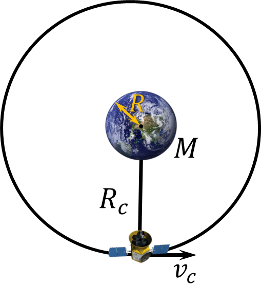

###  Statement

$2.6.48^*.$ The satellite moving in a circular orbit of radius $R_c$ was instantly slowed down and began to move in an elliptical orbit touching the initial orbit and the surface of the planet. Determine the time of the satellite's impact on the planet. Radius of the planet $R$, acceleration of gravity on the surface $g$.

### Solution

Gravitational force could be found as

$$
G\frac{mM}{R^2} = mg \Rightarrow \boxed{GM=gR^2}
$$

Falling could be represented as an eclipse with semi-major $a$ and semi-minor $b$ axes with $b \to 0$. The falling time would be equal to the half of the period

$$
t = \frac{T}{2}
$$

And the length of the semi-major axes could be expressed as

$$
a = \frac{R+R_c}{2}
$$

From Newton's third law

$$
\frac{T^2}{a^3}=\frac{4\pi^2}{GM}
$$

After substituting all of the above expressions

$$
\frac{T^2}{a^3}=\frac{4\pi^2}{GM}\Rightarrow {4}\frac{8t^2}{\left(R+R_c\right)^3}={4}\frac{\pi^2}{gR^2}
$$

After mathematical transformations

$$
\frac{8t^2}{\left(R+R_c\right)^3}=\frac{\pi^2}{gR^2}
$$

From where we express the time of fall

$$
\boxed{t=\pi\sqrt{\frac{R}{g} \frac{\left(1+R_c/R\right)^3}{8}}}
$$

#### Answer

$$
t=\pi\sqrt{R/g}~\left[(1+R_c/R)/2\right]^{3/2}
$$