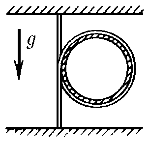
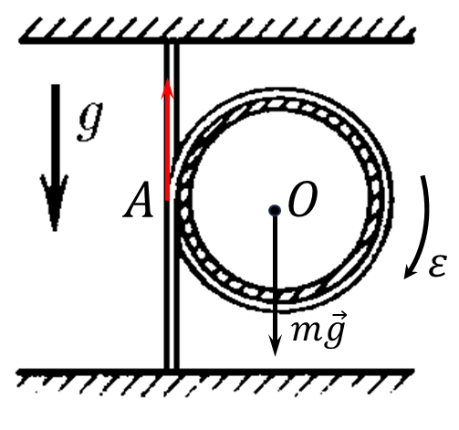

###  Statement 

$2.7.19^*.$ A uniform heavy rope, the ends of which are fixed on the same vertical, covers a weightless hoop. How fast does the hoop fall when released? 

### Solution

  Rotation of the hoop 

Hoof's moment of inertia $$I_0=mR^2$$ Parallel axis theorem for point $A$ $$I_A=2mR^2$$ We express the external gravity moment $mg$, through the moment of inertia and angular acceleration $$I_A\cdot\varepsilon =mgR\Leftrightarrow 2mR^2\cdot\varepsilon =mgR\quad(1)$$ When there is no slippage $$a = \varepsilon R$$ Then, the $(1)$ expression could be rewritten as $$2a = g\Rightarrow\boxed{a=\frac{1}{2}g}$$ 

#### Answer

$$a=g/2$$ 
