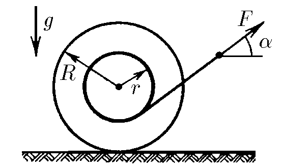
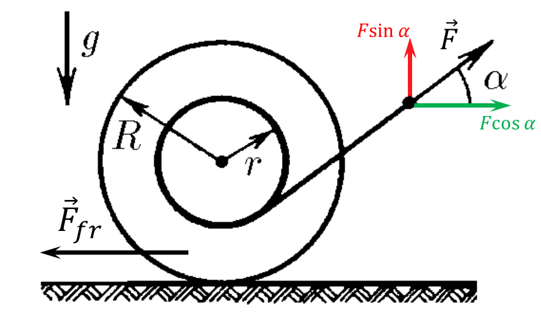

###  Statement

$2.7.20^*.$ A spool of thread lies on a horizontal plane. The reel is pulled by a thread. At what angles $\alpha$ between the force and the horizontal will the coil accelerate towards the taut thread?

### Solution

The second Newton's law for the horizontal axis

$$
ma=F\cos\alpha -F_{fr}\tag{1}
$$

Let's write a moment of inertia with respect to the axis of rotation of the spool with angular acceleration $\varepsilon $

$$
F_{fr}\cdot R - F\cdot r = \frac{mR^2}{2}\cdot \varepsilon \tag{2}
$$

The moment of inertia of the spool in our model (a solid cylinder, symmetry axis)

$$
I=\frac{mR^2}{2}
$$

Because there's no slippage:

$$
a=\varepsilon \cdot R\tag{3}
$$

Let's substitute $(3)$ into $(1)$

$$
F_{fr}=F\cos\alpha -m\varepsilon R\tag{4}
$$

and put into $(2)$

$$
\left(F\cos\alpha -m\varepsilon R\right)\cdot R - F\cdot r = \frac{mR^2}{2}\cdot \varepsilon
$$

After algebraic transformations

$$
F\left(R\cos\alpha -r\right)=\frac{3mR^2\varepsilon }{2} \Leftrightarrow \boxed{\varepsilon =\frac{2F\left(R\cos\alpha -r\right)}{3mR^2}} \tag{5}
$$

For the angular acceleration to be clockwise, and consequently the motion to be co-directional with the direction of $\vec{F}$, the external force moment from equation $(2)$ must be positive, and consequently the expression $(5)$ must be greater than 0. The moment of external forces in equation $(2)$ must be positive $(\varepsilon = 0)$

$$
\frac{2F\left(R\cos\alpha -r\right)}{3mR^2}>0
$$

$$
R\cos\alpha -r>0\Leftrightarrow \boxed{\cos\alpha >\frac{r}{R}}
$$

The larger the angle $\alpha$, the smaller the value of the trigonometric function $\cos\alpha$, making the expression for the angle

$$
\boxed{\alpha <\arccos \left(\frac{r}{R}\right)}
$$

#### Answer

$$
\cos\alpha >\frac{r}{R}
$$