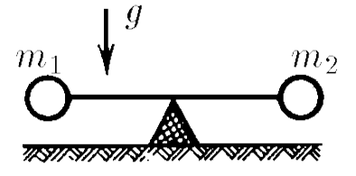

###  Statement

$2.7.27^*.$ A light rod with weights of mass $m_1$ and $m_2$ fixed to its ends rests with its middle on a rigid support. At the initial moment, the rod is held horizontally and then released. With what force does it press on the support immediately after it is released?

### Solution

Newton's second law for a rotational movement

$$
M = I\varepsilon
$$

$$
m_1gR - m_2 g R = I\varepsilon\quad(1)
$$

Since there is no slippage:

$$
\varepsilon = \frac{a}{R}
$$

Substituting into $(1)$

$$
\boxed{(m_1 - m_2) g R^2 = Ia}\quad(2)
$$

Conservation of angular momentum

$$
I\omega = m_1vR + m_2vR\quad(3)
$$

Let's express velocity through angular velocity

$$
v=\omega R\quad(4)
$$

After substituting $(4)$ into $(3)$

$$
\boxed{I = (m_1+m_2)R^2} \quad (5)
$$

Let's equate the expressions $(2)$ and $(5)$

$$
(m_1 - m_2) g R^2 = (m_1+m_2)aR^2
$$

After mathematical transformations

$$
a = g \frac{m_1 - m_2}{m_1 + m_2}\quad(6)
$$

Describe the forces acting on the vertical axis

$$
N = (m_1+m_2)g - a (m_1-m_2)\quad(7)
$$

Substituting the acceleration $(6)$ into expression $(7)$

$$
N = g\cdot\left((m_1+m_2)+ \frac{(m_1-m_2)^2}{m_1+m_2}\right)
$$

From here we find the support reaction force:

$$
\boxed{N = \frac{4m_1m_2g}{m_1+m_2}}
$$

#### Answer

$$
N = 4m_1m_2g/(m_1 + m_2)
$$

Mustafa Bakhodirov