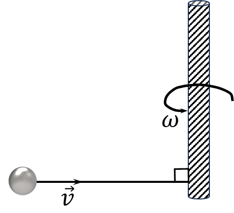

###  Statement

$2.7.41.$ A thin rod of mass $m$ and length $l$ lies on a smooth horizontal surface. A plasticine ball of mass $m$ with a velocity $v$ perpendicular to the rod hits one of its ends and sticks to it. How much heat will be released from such an impact?

### Solution

After collision they will move as a unit, rotating around the centre of mass, which is at a distance $l/4$ from the contact point of the balls

  Rotations around the centre of mass

Conservation of angular momentum

$$
mv\cdot\frac{L}{4}=m\frac{\omega L}{4}\cdot\frac{L}{4}+I\omega\quad(1)
$$

Determening the moment of inertia, using parallel axis theorem

$$
I=\frac{1}{2}mL^2+m\left(\frac{L}{4}\right)^2=\frac{7}{48}mL^2\quad(2)
$$

From the $(1)$ and $(2)$

$$
v=\frac{5}{6}\omega L\Rightarrow \boxed{\omega =\frac{6v}{5L}}
$$

Also, in addition to rotational motion, translational motion will be observed. From the law of conservation of momentum

$$
mv=2mu\Rightarrow u=v/2
$$

$u$ — centre of mass velocity

THe initial energy was as a kinetic energy

$$
E_0=\frac{mv^2}{2}
$$

The total energy after the collision:

$$
E_f=\frac{2mu^2}{2}+\frac{I\omega^2}{2}+\frac{m(\omega\cdot L/u)^2}{2}
$$

Conservation of energy

$$
E_0=E_f+Q
$$

Where, $Q$ — the released energy

$$
Q=E_0-E_f
$$

$$
Q=\frac{mv^2}{2}-\frac{mv^2}{2\cdot2}-\frac{7mL^2}{48}\cdot \left(\frac{6v}{5L}\right)^2\cdot \frac{1}{2}+\frac{m\cdot(6v/5L\cdot L/4)^2}{2}
$$

After the mathematical transformations

$$
\boxed{Q=\frac{mv^2}{10}}
$$

#### Answer

$$
Q=1/10\cdot mv^2
$$