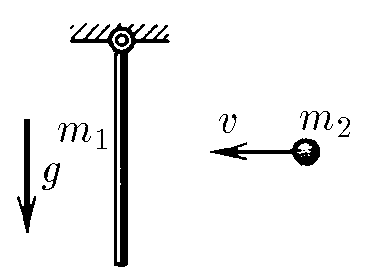
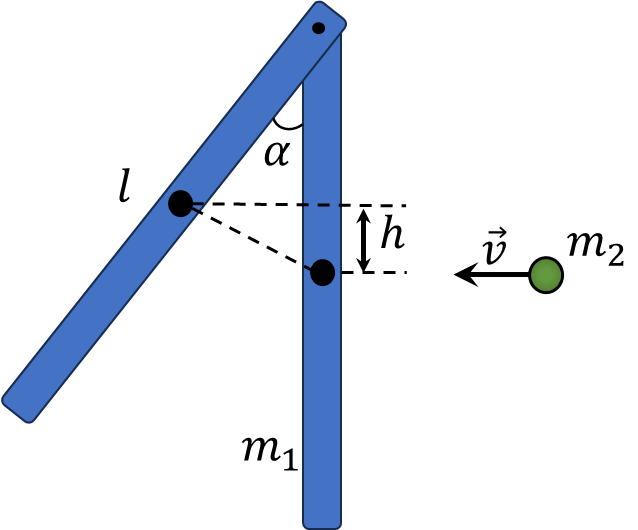

###  Statement 

$2.7.42.$ A rod of mass $m_1$ and length $l$ is suspended on a hinge. A small piece of plasticine of mass $m_2$ sticks to the middle of the rod, moving until it collides with it horizontally at a speed of $V$. Find the maximum angle of deviation of the rod from the vertical. Ignore the friction in the hinge. 

### Solution

  Geometry of the problem 

Angular momentum $$\left\\{\begin{matrix} L=m_2v\frac{l}{2} \\\ L=I\omega \end{matrix}\right.$$ Parallel axis theorem $$I=I_0+m_2d^2=\frac{1}{3}m_1l^2+m_2\left(\frac{l}{2}\right)^2$$ $$m_2v\frac{l}{2}=\omega\left(\frac{1}{3}m_1l^2+\frac{1}{4}m_2l^2\right)$$ From where $$\omega = \frac{6m_2}{4m_1+3m_2}\frac{v}{l}$$ From the figure $$h=\frac{l}{2}(1-\cos\alpha )$$ Law of conservation of energy in rotational motion $$\frac{I\omega^2}{2}=(m_1+m_2)\frac{l}{2}(1-\cos\alpha )$$ Expressing $\cos\alpha$ $$1-\cos\alpha =\frac{I\omega^2}{(m_1+m_2)l}$$ $$\boxed{\cos\alpha =1-\frac{3m_2^2v^2}{gl(4m_1+3m_2)(m_1+m_2)}}$$ 

#### Answer

$$\cos\alpha =1-\frac{3m_2^2v^2}{gl(4m_1+3m_2)(m_1+m_2)}$$ 
