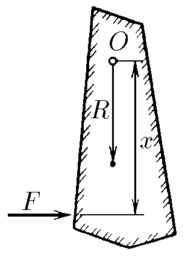
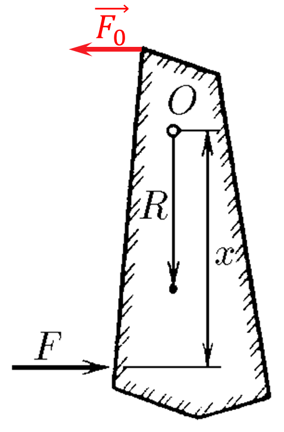

###  Statement

$2.7.44.$ The moment of inertia of a solid body of mass $m$ relative to the $O$-axis is equal to $J$. The center of mass of the body is located at a distance $R$ from this axis. Find the force acting on the axis when a force $F$ is briefly applied to a solid body perpendicular to the segment of length $x$ that connects the point of application of the force and the axis. At which $x$ is the smallest force acting on the axis?

### Solution

Force $\vec{F}$ creates an angular momentum $\vec{F}\cdot x$ (with $x$ perpendicular to $\vec{F}$):

$$
\tau_0=F\cdot x
$$

$$
\tau_f=J\cdot\varepsilon
$$

In steady-state mode, the angular moments will be equal

$$
\tau_0=\tau_f=Fx=J\varepsilon
$$

From where

$$
\varepsilon = \frac{Fx}{J}
$$

Newton's second law

$$
F-F_0=m\varepsilon R
$$

$$
F_0=F-mR\cdot \frac{Fx}{J}\Leftrightarrow \boxed{F_0=F\left(1-\frac{mRx}{J}\right)}
$$

From here, the minimum values of $F_0 = 0$, described by the expression

$$
F_0=0\Leftrightarrow 1-\frac{mRx}{J}=0
$$

which will be observed at length that connects the point of application of the force and the axis

$$
\boxed{x=\frac{J}{mR}}
$$

#### Answer

$F'=F(1-mRx/J)$. With $x=J/(mR),~F'=0$