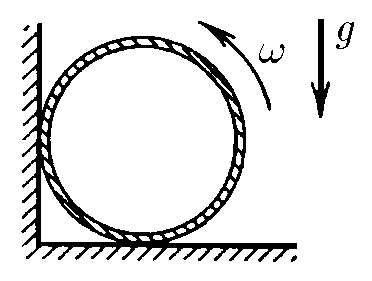

###  Statement

$2.7.6.$ A thin-walled cylinder of radius $R$ was spun up to an angular velocity $\omega$ and placed in a corner, as shown in the figure. The coefficient of friction between the corner walls and the cylinder is $\mu$. How many revolutions will the cylinder make before it comes to a complete stop?

### Solution

  Forces acting on the cylinder

Conditions of equilibrium:

$$
\left\\{\begin{matrix} O'X\text{: }F_{fr2} = N_1 \\\ O'Y\text{: }F_{fr1}+N_2 = mg \\\ \end{matrix}\right.
$$

From where

$$
\left\\{\begin{matrix} \mu N_2=N_1 \\\ \mu N_1+N_2=mg \\\ \end{matrix}\right.
$$

Let's find friction force

$$
F_{fr}=F_{fr1}+F_{fr2}
$$

$$
F_{fr}=\mu (N_1+N_2)=\mu N_2(1+\mu )
$$

Considering, $mg = N_2(1+\mu^2)$:

$$
N=\frac{mg}{1+\mu^2}
$$

According to rotational motion dynamics, the sum of moments of external forces can be written as

$$
M=I\varepsilon = mR^2=F_{fr} R
$$

From where, absolute value of angular acceleration is found as

$$
\varepsilon = \frac{M}{I} = \frac{F_{fr}}{mR}
$$

$$
\varepsilon = \frac{\mu (1+\mu )N_2 }{mR}
$$

$$
\varepsilon = \frac{\mu (1+\mu )}{1+\mu^2} \frac{g}{R}
$$

The angle by which the cylinder will rotate to the moment of total stop is

$$
\varphi=\frac{\omega^2t}{2\varepsilon }
$$

Until the total stop, the cylinder will make $N$ total turnovers

$$
\varphi=2\pi N
$$

From where

$$
N=\frac{\omega^2t}{4\pi\varepsilon }
$$

$$
\boxed{N=\frac{1+\mu^{2}}{4\pi\mu (1+\mu )}\frac{\omega^{2}R}{g}}
$$

#### Answer

$$
N=\omega^{2}R(1+\mu^{2})/[4\pi g\mu (1+\mu )]
$$