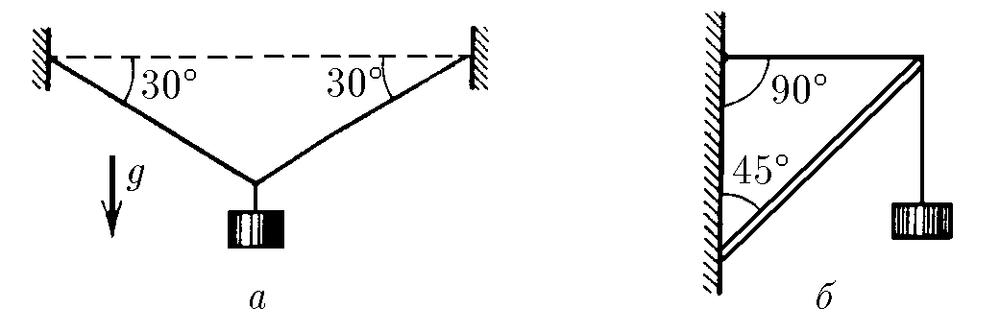
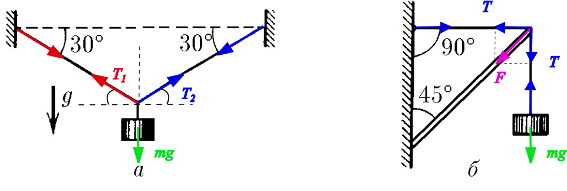

###  Statement

$2.8.1$ The figure shows structures that hold a load weighing 10 kg. The cables are represented by thin lines, the rod is represented by a double line. Determine the tension force of the cables for case a and the force acting on the rod from the side of the cable thrown over it for case b.

### Solution

Let's consider the following figure

  Force analysis

$a$. Applying Newton Second Law for $x$-direction

$$
T_2~\cos{30^\circ}-T_1~\cos{30^\circ}=0
$$

$$
T_1=T_2 \quad(1)
$$

for $y$-direction

$$
(T_1+T_2)~\sin{30^\circ} = mg \quad(2)
$$

Let be $T_1=T_2=T$, so, back to $(2)$

$$
2T~\sin{30^\circ}=mg
$$

$$
T = \frac{mg}{2~\sin{30^\circ}} = mg = \boxed{98~\rm{N}}
$$

$b$. According figure,

$$
F^2 = T^2+T^2 = 2T^2
$$

We consider the same tension $T$ because we suppose the threads are unextensible.

$$
F = \sqrt{2}~T \quad(3)
$$

Applying Newton Second Law

$$
T = mg \quad(4)
$$

Putting $(4)$ into $(3)$

$$
F = \sqrt{2}~mg = \boxed{138~\rm{N}}
$$

Note: Calculations were made considering $g$ = 9.8 N/kg and $\sqrt{2}$ = 1.41.