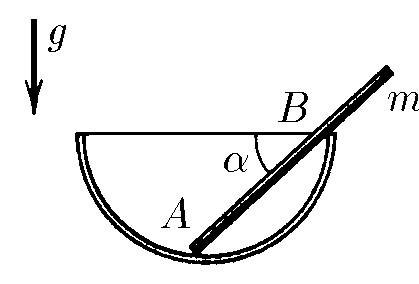

###  Statement

$2.8.11.$ In a smooth fixed hemisphere, a stick of mass $m$ freely lies so that its angle with the horizon is equal to $\alpha$, and its end extends beyond the edge of the hemisphere. With what forces does the wand act on the hemisphere at the points of contact between $A$ and $B$?

### Solution

  Forces acting on the stick

Equilibrium condition for vertical and horizontal axes respectively

$$
mg = N_A \sin2\alpha +N_B\cos\alpha\quad(1)
$$

$$
N_A \cos2\alpha = N_B\sin\alpha\quad(2)
$$

Moment of forces with respect to point $A$

$$
mg\cos\alpha\cdot \frac{l}{2} = N_B\cdot l_{AB}\quad(3)
$$

Alternatively, moment of forces with respect to point $B$

$$
mg\cos\alpha\cdot \left(l_{AB} - \frac{l}{2}\right) = N_A\sin\alpha\cdot l_{AB}\quad(4)
$$

Substituting in $(2)$, $(3)$ and $(4)$

$$
\frac{l}{l_{AB}} = \frac{2\cos2\alpha}{\cos^2 \alpha}
$$

$$
\boxed{N_A = mg\tan\alpha}
$$

$$
\boxed{N_B = mg\frac{\cos2\alpha}{\cos\alpha}}
$$

#### Answer

$$
F_A=mg\operatorname{tg}\alpha ; F_B=mg\cos2\alpha /\cos\alpha
$$