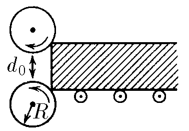
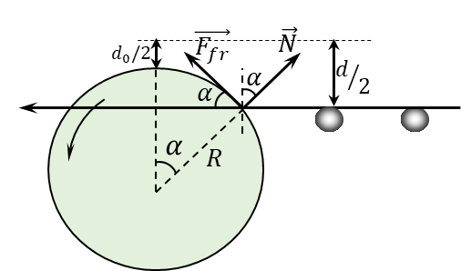

###  Statement

$2.8.13.$ Rolling mill rolls have radius $R$. Rotating, they retract the workpiece, if its thickness is small enough. The coefficient of friction between the rolls and the workpiece is $\mu$, and the gap between the rolls is $d_0$. Find the maximum thickness of the blank. The blank is not pushed.

### Solution

As the thickness of the workpiece increases, there will come a point where the mill rolls can no longer roll the workpiece.

It will happen until the vertical projection of friction force $\vec{F}_\text{fr}$ will exceed the vertical component of the support reaction force $\vec{N}$

$$
F_\text{fr}\cos\alpha\geq N\sin\alpha
$$

Considering the value of friction force $F_\text{fr} = \mu N$:

$$
\mu = \tan\alpha\tag{1}
$$

From the drawing

$$
\frac{d-d_0}{2} = R(1-\cos\alpha ) \Rightarrow \boxed{d = d_0 + 2R(1-\cos\alpha )}\tag{2}
$$

From the expression $(1)$,

$$
\cos\alpha = \frac{1}{\sqrt{1+\tan^2\alpha}}=\frac{1}{\sqrt{1+\mu^2}}\tag{3}
$$

After substituting $(3)$ into $(2)$, we could obtain the maximum thickness of the blank

$$
\boxed{d = d_0 + 2R\left(1-\frac{1}{\sqrt{1+\mu^2}}\right)}
$$

#### Answer

$$
d_\text{max}=d_0+2R\left(1-1/\sqrt{1+\mu^2} \right)
$$