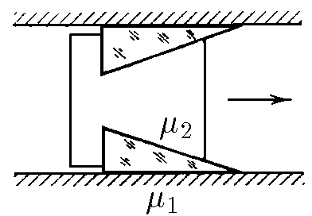
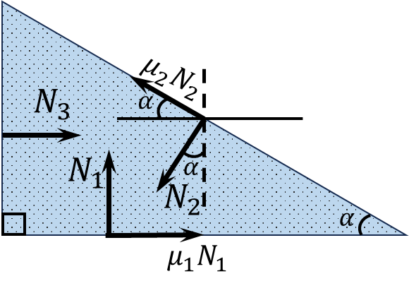

###  Statement

$2.8.14^*.$ The body with wedges installed in its cutouts is located between two parallel walls as shown in the figure. Find the limit angle at the top of the wedges at which the body can move to the right and cannot move to the left. The coefficients of friction of the wedges against the walls and body are equal to $\mu_1$ and $\mu_2$, respectively.

### Solution

State of forces equilibrium for the wedge for the horizontal axis:

$$
N_3+\mu_1N_1=\left(\mu_2\cos\alpha +\sin\alpha\right)N_2
$$

In the set mode, the force that will act on the left wall will be equal to zero ($N_3=0$)

$$
\frac{N_1}{N_2}=\frac{\mu_2\cos\alpha +\sin\alpha}{\mu_1}\tag{1}
$$

Similarly, for the vertical axis

$$
N_1+\mu_2N_2\sin\alpha =N_2\cos\alpha
$$

$$
\frac{N_1}{N_2}=\cos\alpha -\mu_2\sin\alpha\tag{2}
$$

Substituing $(2)$ into $(1)$

$$
\mu_1\cos\alpha -\mu_1\mu_2\sin\alpha =\mu_2\cos\alpha +\sin\alpha
$$

Divide the left and right parts by $\cos\alpha$

$$
\left(1+\mu_1\mu_2\right)\tan\alpha =\mu_1-\mu_2
$$

Whence the required angle

$$
\boxed{\tan\alpha =\frac{{\mu}_{1}-\mu_{2}}{1+\mu_{1}\mu_{2}}}
$$

#### Answer

$$
\operatorname{tg}\alpha =({\mu}_{1}-\mu_{2})/(1+\mu_{1}\mu_{2})
$$