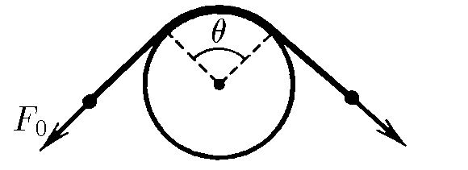
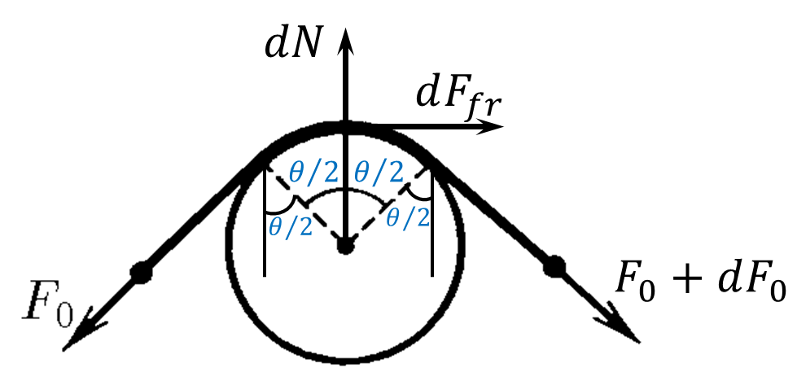

###  Statement 

$2.8.17^*.$ For one end of the rope covering the pole in an arc with an angle of $\theta$, pull with a force of $F_0$. What is the minimum force needed to be applied to the other end of the rope to hold it, if the coefficient of friction of the rope against the post is $\mu$? 

### Solution

  For problem $2.8.17^*$ 

State of equilibrium for vertical axis $$(F_0+F_0+dF_0)\cdot\sin\left(\frac{d\theta}{2}\right)=dN$$ Approximation for small angles $$\sin\left(\frac{d\theta}{2}\right)\approx\frac{d\theta}{2}$$ Let's neglect the second order of magnitude summand $(dF_0d\theta\to 0)$ $$F_0\cdot d\theta =dN$$ Alternatively, the state of equilibrium for the horizontal axis $$F_0\cos\left(\frac{d\theta}{2}\right)=(F_0+dF_0)\cos\left(\frac{d\theta}{2}\right)+d\vec{F}_\text{fr}$$ Approximation for small angles $$\cos\left(\frac{d\theta}{2}\right)\approx1$$ $$dF_\text{fr}=-dF_0$$ $$dF_\text{fr}=\mu\, dN$$ $$-dF_0=\mu F_0d\theta\Leftrightarrow \boxed{-\frac{dF_0}{F_0}=\mu d\theta}$$ Integrating of both sides of equation $$-\int_{F_0}^{F}\frac{dF}{F}=\mu\int_0^\theta d\theta$$ $$\ln \left|\frac{F_0}{F}\right|=\mu\theta$$ Substituting the minimum force $F$: $$\frac{F_0}{F}=e^{\mu\theta}\Rightarrow \boxed{F=F_0e^{-\mu\theta}}$$ 

#### Answer

$$F=F_0e^{-\mu\theta}$$ 
