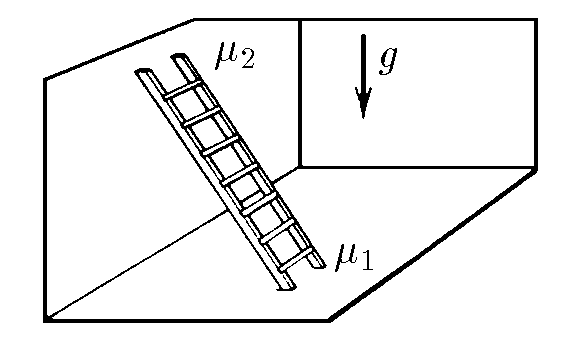
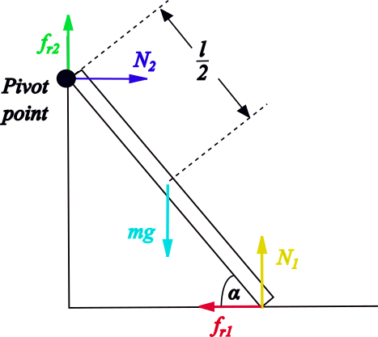

###  Statement

$2.8.34$ The staircase rests on a vertical wall and floor. At what values of the angle between the ladder and the floor can it stand if the coefficients of friction of the ladder on the floor and on the wall are equal to $\mu_1$ and $\mu_2$, respectively?

### Solution

See the following figure...

Let's consider the Newton Second Law for both axis. Firstly, for $x$-axis,

$$
N_1+f_{r2} = mg
$$

$$
N_1+\mu_2 N_2 = mg \quad(1)
$$

For $y$-axis,

$$
N_2 = f_{r1}
$$

$$
N_2 = \mu_1 N_1 \quad(2)
$$

Substituting $(2)$ into $(1)$:

$$
N_1 (1+\mu_1 \mu_2) = mg \quad(3)
$$

Applying Newton Second Law for the rotation about the pivot point,

$$
\sum \vec{\tau} = \vec{0}
$$

$$
-mg\frac{l}{2}\sin{\frac{\pi}{2}-\alpha}+N_1 l\sin{\frac{\pi}{2}+\alpha}-f_{r1} l \sin{\pi -\alpha} = 0
$$

where $l$ is the staircase's length. Now, for avoiding that staircase slides over ground $\sum \tau\leq 0$, then

$$
-mg\frac{l}{2}\sin{\frac{\pi}{2}-\alpha}+N_1 l\sin{\frac{\pi}{2}+\alpha}-f_{r1} l \sin{\pi -\alpha} \leq 0
$$

$$
-mg\frac{l}{2}\sin{\frac{\pi}{2}-\alpha}+N_1 l\sin{\frac{\pi}{2}+\alpha}-\mu_1 N_1 l \sin{\pi -\alpha} \leq 0
$$

Developing the above expression,

$$
mg \geq 2N_1(1-\mu_1 \tan{\alpha}) \quad(4)
$$

Putting $(3)$ into $(4)$, and separating $\tan{\alpha}$ term,

$$
\boxed{\tan{\alpha} \geq \frac{1-\mu_1 \mu_2}{2 \mu_1}}
$$