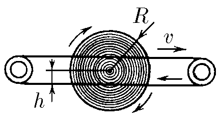
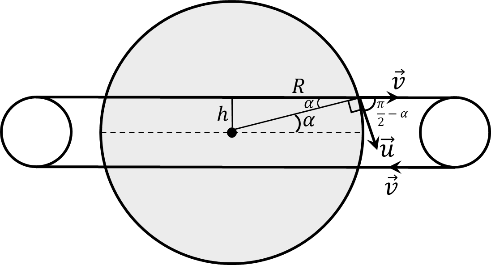

###  Statement

$2.8.37^*.$ A wheel of radius $R$ can rotate freely around its axis. Drive belts moving at a speed $v$ are pressed against the side surface of the wheel at a distance $h$ from the axis of rotation. Determine the steady-state angular velocity of the wheel if its contact with the drive belt occurs only along the rim.

### Solution

In order for the wheel to move it is necessary that a moment of force associated with the frictional force from drive belts is transmitted, which is directed along the axis of rotation.

Thus, the momentum will make an angle with velocity $v$ equal to $\pi -\alpha$

Projecting onto the linear rotation speed of the wheel:

$$
u=v\cos(\frac{\pi}{2}-\alpha )=v\sin\alpha\tag{1}
$$

From the drawing

$$
\sin\alpha = \frac{h}{R}
$$

Substituting into $(1)$

$$
u=v \frac{h}{R}
$$

From where we find the linear velocity, given that the wheel is circular

$$
\boxed{\omega =\frac{u}{R}=v \frac{h}{R^2}}
$$

#### Answer

$$
\omega =\frac{hv}{R^2}
$$