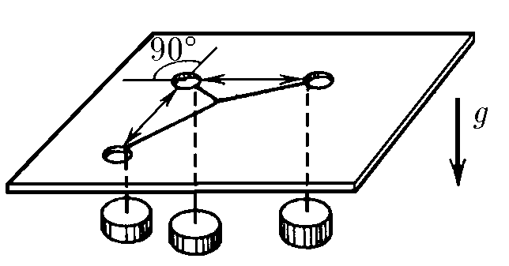
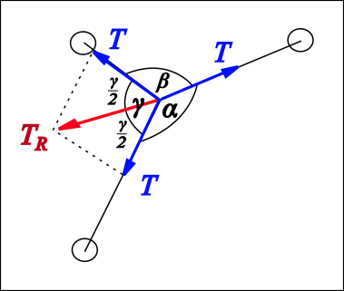

###  Statement

$2.8.4$ Through three holes made in a desktop pass threads united by a common knot. At the free ending of each thread is hanged equal loads. Determine the angles between threads. There is no friction.

### Solution

Tension in each thread is the same ($T=mg$). Moreover, note that the absolute value of the sum of two any tensions must be equal to the third one which is also $T$ and be directed in opposed sense for maintain the equilibrium. So, consider for example the angle $\gamma$

$$
T_R = T = 2T\cos{\frac{\gamma}{2}}
$$

Hence

$$
\cos{\frac{\gamma}{2}} = 0.5
$$

$$
\gamma = \frac{2\pi}{3} = 120^\circ
$$

But, since the above condition of the sum of two any tensions always is true, the three angles must be equal.

$$
\boxed{\alpha =\beta =\gamma =120^\circ}
$$