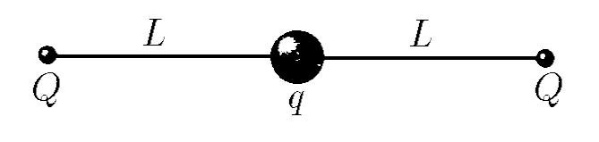

###  Statement 

$3.1.10^*.$ A bead with charge $q$ can move without friction along a stretched string of length $2 L$ with charges $Q$ attached to its ends. Find the increment of potential energy when the bead moves $x$ along the string from its center. Find that for small displacements the dependence of the increment of potential energy on $x$ is quadratic. Find how much the bead of mass $m$ will be displaced if it is given a small velocity $v$ at the equilibrium position. 

### Solution

Initial energy of the electric field $$ U_1=\frac{2kQq}{L} $$ Energy of the system after the bead is displaced $$ U_2=\frac{kQq}{L-x}+\frac{kQq}{L+x} $$ Change in energy of the system $$ \Delta U=U_2-U_1=kQq\left(\frac{1}{L-x}+\frac{1}{L+x}-\frac{2}{L}\right) $$ Let us consider the transformation for small values ​​of $(1+\xi )^\alpha =1+\alpha\xi$, where $\xi\ll1$ $$ \boxed{\Delta U \approx\frac{Qqx^2}{2\pi\varepsilon_0L^3}} $$ From the principle of conservation of energy it follows that the kinetic energy will be equal to the change in electrical energy $\Delta U$ $$ E_k=\Delta U\Leftrightarrow \frac{m\upsilon^2}{2}=\frac{Qq\Delta x^2}{2\pi\varepsilon_0L^3} $$ Where do we find the change in length $\Delta x$ $$ \boxed{\Delta x=\upsilon\sqrt{\frac{m\pi\varepsilon_0L^3}{Qq}}} $$ 

#### Answer

$$\Delta U=\frac{Qqx^2}{2\pi\varepsilon_0L^3};\quad\Delta x=\upsilon\sqrt{\frac{m\pi\varepsilon_0L^3}{Qq}}$$ 
