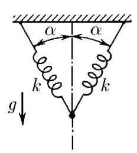

###  Statement

$3.1.11.$ Two springs of stiffness $k$ connected as shown in the figure are not deformed. What mass should the load be suspended from the point where the springs are connected so that it falls a small distance $x$ to the equilibrium position?

### Solution

Each spring will have an elastic force when stretched

$$
F_y=k\Delta l=kx\cos\alpha
$$

Condition of equality of forces

$$
mg=2F_y\cos\alpha =2kx\cos^2 \alpha
$$

Where, weight of cargo

$$
\boxed{m=\frac{2kx\cos^2 \alpha}{g}}
$$

#### Answer

$$
m=\frac{2kx\cos^2 \alpha}{g}
$$